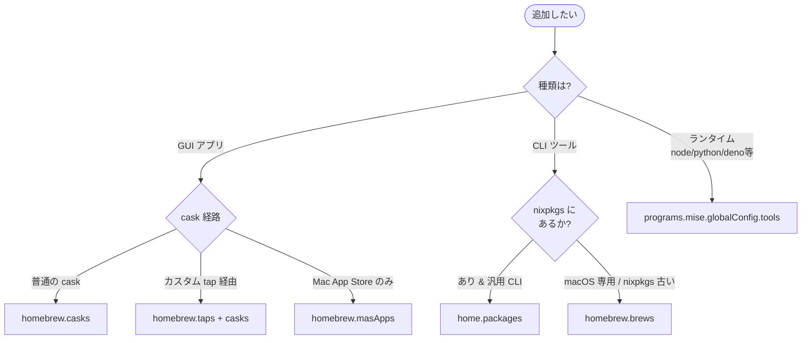

<!--
この文書は CLAUDE.md（英語・正本）の和訳です。人間向け。
最新とは限りません — 基準: 英語版 @ 4eedb58。
同時更新はしない — 人間の指示があった時に、基準 commit からの差分を訳して基準を進める。
-->

# Claude 向け作業指針（このリポジトリ用）

個人 macOS 環境の dotfiles（aarch64-darwin / user: `tommy`）。
スタック: **nix-darwin + home-manager + chezmoi + 1Password**。

## 用語

このリポジトリで使う正規語彙は [`docs/glossary.md`](docs/glossary.md) に従う
— 所有レイヤー（`nix-darwin` / `home-manager` / `chezmoi` / `1Password`）、
chezmoi prefix（`executable_` / `private_` / `modify_` / `create_` / `encrypted_` /
`run_once_` / `run_onchange_`）、ビルド / 適用コマンド（`darwin-rebuild build/switch` /
`chezmoi diff/apply/re-add`）、配布（`install.sh` / `aarch64-darwin`）、
運用（`main` / `feature branch` / `pre-push hook`）など。`Don't call it:`
側の同義語は使わない。用語の追加・改名はコード変更と **同一 PR で** この
ファイルへ反映する。
詳細: [docs/reproduction-architecture.md](docs/reproduction-architecture.md) /
進捗: [docs/roadmap.md](docs/roadmap.md) /
環境素材: [docs/system-inventory.md](docs/system-inventory.md) /
運用: [docs/operations.md](docs/operations.md) /
global CLAUDE.md ルールの強制状態: [docs/claude-md-ledger.md](docs/claude-md-ledger.md)

**最終目標**: このマシンを破棄しても新しい Mac で `install.sh` ワンコマンドで同等の環境が再現できる状態を維持する。

## アーキテクチャ（責務分担、絶対の鉄則）

| 領域 | 所有 | 場所 |
|---|---|---|
| パッケージ（nixpkgs にあるもの） | **home-manager** | `home/modules/packages.nix` |
| GUI / cask / カスタム tap / mas | **nix-darwin homebrew** | `system/modules/homebrew.nix` |
| macOS defaults | **nix-darwin** | `system/modules/defaults.nix` |
| DSL のあるプログラム設定（zsh など） | **home-manager** `programs.*` | `home/modules/*.nix` |
| 手編集の生 dotfile / バイナリ資産 | **chezmoi** | `chezmoi/dot_*` |
| シークレット（SSH 鍵 / PAT 等） | **chezmoi + 1Password `op`** | `chezmoi/private_*.tmpl` |
| Claude の指示書 / skill / agent / hook | **chezmoi** | `chezmoi/private_dot_claude/`・`chezmoi/dot_local/bin/` |

**1 ファイル 1 所有**。Nix と chezmoi の両方が同じファイルを管理してはいけない（事故の主因）。

## インストール先の判断フロー



**原則: 迷ったら Nix**（reproducibility / Linux 互換 / hash pin）。GUI と macOS 統合（SSH agent / Spotlight / pkg-installer 等）が要るものは無理に Nix にしない。

グレーゾーン例:

| 対象 | 採用 | 理由 |
|---|---|---|
| `_1password-cli` (op) | Nix | CLI、nixpkgs にある、`onepasswordRead` template の前提 |
| `1password` GUI | Brew cask | `.app`、SSH agent / op CLI 連携が cask に乗る |
| `font-*-nerd-font` | Brew cask | cask 版は `~/Library/Fonts` に置くので Spotlight / 他アプリから見える |
| `docker` CLI | Nix | colima 経由、CLI のみ必要 |
| `mise` 本体 | home-manager `programs.mise` | `enable = true` で zsh init まで自動 wiring |

## レイアウト規約

- `.chezmoiroot = chezmoi` — リポジトリ直下は Nix flake、dotfile ソースは `chezmoi/` 配下。
- リポジトリ運用ファイル（`README.md` `install.sh` `docs/` `.github/` `CLAUDE.md` 等）は `chezmoi/` の**外**にあるため `$HOME` に適用されない。
- `chezmoi/` 配下のスクリプトは `executable_` 接頭辞で +x を再現（**CI で強制**）。
- 例外的に `run_*` と `.chezmoiscripts/` 配下は chezmoi 自身が実行するので接頭辞不要。

## GitHub / CI

- **`main` は唯一の永続ブランチ**（2026-05-27 に `rebuild` を統合・削除。CI も main へ単発）。作業は短命な feature ブランチを切り、**PR 経由で `main` に squash-merge** する（直 push はしない）。
- **フロー**: `git checkout -b <type>/<topic>` → 論理単位で commit → `git push -u origin <branch>` → `gh pr create` → CI green → `gh pr merge --squash`（`--auto` 可）。実例は [docs/operations.md](docs/operations.md)。
- **コミットメッセージは gitmoji-driven**（`<:gitmoji:>[(<scope>)][!] <subject>`。Conventional の `<type>` 語は退役済み）。規約の正本は .github の [CONTRIBUTING.md](https://github.com/akira-toriyama/.github/blob/main/CONTRIBUTING.md)（[docs/commit-convention.md](docs/commit-convention.md) は fleet 配布のポインタ・機械検査 = `glyph lint`）。**push 前に `glyph lint --range origin/main..HEAD`**（履歴には退役形式の commit が残っているので `git log` を手本にしない）。
- **CI ジョブ（[.github/workflows/ci.yml](.github/workflows/ci.yml)、push と PR でトリガー）**:
  - `nix flake check --no-build` — Nix の型/eval 検査（Linux runner）
  - `lint` — `scripts/lint` 一本（ruff / mypy --strict / shfmt / shellcheck / actionlint / typos / lychee --offline / gitleaks / `.tmpl` は render 後に shellcheck・plist 構文 / コードスパン内のパス実在）。**ローカルでも同じコマンドが走る**: `nix develop .#lint --command scripts/lint`
  - `script test` — Stop hook の fixture テスト + `scripts/` と `scripts/claude-md-eval/` の unittest
  - 規約検知 — `chezmoi/` 配下 shebang スクリプトの `executable_` 接頭辞を強制（例外: `run_*` / `modify_*` / `.chezmoiscripts/`）
  - `chezmoi templates render` — 全 `.tmpl` の `execute-template` 検証
- **CI green を確認してからマージ**。失敗したら**新規コミットで修正**する（`--amend` / `--force` push / 履歴改変の可否は「作業時の絶対ルール」4 が正本）。
- **push 時、pre-push フック（[.githooks/pre-push](.githooks/pre-push)）は chezmoi/ を触る push で `chezmoi verify` を実行し、乖離があれば警告するが止めない（warn-only、2026-07-03〜。Claude 主導運用のため）**。気づいたら `chezmoi apply` で live を追従する。恒久ゲートは CI（darwin build/switch smoke + chezmoi apply + templates render）と main のブランチ保護が担う。詳細 → [docs/operations.md §5.11](docs/operations.md)。

## シークレット取扱（YOU MUST）

- **YOU MUST NOT** secret 値（API トークン / 鍵 / パスワード / PAT 等）を **print / log / echo / コミットメッセージ / コマンド文字列 / テンプレートにリテラル化** しない。
- secret は常に **参照** で扱う: `$(op read "op://Vault/Item/field")` / `$(gh auth token)` / `$ENV_VAR`。
- chezmoi テンプレで秘密を扱うときは `onepasswordRead "op://..."` を使い、`op signin` は既に通っている前提とする。
- **`home.file.*.text` に secret を書かない**（`/nix/store` は world-readable）。
- secret ファイルを chezmoi に置く場合は `private_` 接頭辞（権限 600）か `encrypted_` 接頭辞（age/gpg）必須。

## 作業時の絶対ルール

1. **検証ゲートを必ず通す**:
   - chezmoi 編集後 → `chezmoi diff` でソース⇔実体一致を確認してから commit
   - Nix 編集後 → `nix flake check` ＋ `darwin-rebuild build`（非破壊）通過後に switch
2. **`switch` は sudo パスワード入力が要るので、コマンドを提示してユーザーに実行させる**（このセッションからは sudo を直接呼ばない）。
3. **生成パイプラインを再導入しない**。設定は静的ファイルとして表現する。
4. **破壊的 git 操作を避ける**: `--force` push / 履歴改変 / `--amend`（push 済みコミットへ）はユーザー明示指示なしに禁止。
5. **この repo は Claude 主導運用（2026-07-03〜）**: 通常の git / gh / chezmoi / PR 操作（branch 作成・commit・push・PR open/merge・`chezmoi diff/apply`）は都度ユーザー確認を取らず実行してよい。例外は上のルールが押さえる: ① `darwin-rebuild switch`（sudo）はルール 2 のとおりコマンド提示してユーザーに実行させる ② 破壊的 git はルール 4 のとおりユーザー明示指示時のみ ③ 検証ゲート（ルール 1）は「聞く」のでなく「自分で通す」。

## global CLAUDE.md / skill の散文を変えるとき（この repo 固有の義務）

global `~/.claude/CLAUDE.md` の source はこの repo（`chezmoi/private_dot_claude/CLAUDE.md`）に
あるため、その変更義務はここに置く（常時ロードされる global 側には置かない）。

- **挙動を狙う散文**（出力の形・作業の締め・skill の description 級）を変えたら、配る前に
  [`scripts/claude-md-eval`](scripts/claude-md-eval/README.md) で測る（読んだだけでは効くか
  分からない — 初稿 8 規則中 2 つが不良品だった実績）。事実の訂正・ポインタ化・圧縮だけの
  編集は対象外。全面改稿は `--baseline`（旧版 vs 新版の 2 腕）で測る。
- ルールを足す・削る・移す PR は [docs/claude-md-ledger.md](docs/claude-md-ledger.md) の
  該当行（削除なら削除記録節）を**同一 PR で**更新する。
- CLAUDE.md か skills/ に触る PR は [docs/glossary.md](docs/glossary.md) の該当語も**同一
  PR で**追従させる（不要なら commit footer `Glossary-unchanged: <理由>`）。台帳と対の
  義務で、どちらも lint ゲート claude-md-guard が強制する。
- global CLAUDE.md の肥大を再演しない: 追加は「既に踏んだ失敗の再発防止」だけ
  （global の機構化ルールと同じ基準を散文にも適用する）。

## 既知の落とし穴（読まずに「修正」を試みない）

- `sudo darwin-rebuild` は PATH を引き継がないので **`sudo /run/current-system/sw/bin/darwin-rebuild ...`** とフルパス指定する。
- Determinate Nix と二重管理しないため **`nix.enable = false`**（host nix に設定済）。`/etc/nix/nix.custom.conf` には触らない。
- switch 直後の親シェルでは `__NIX_DARWIN_SET_ENVIRONMENT_DONE=1` を継承して PATH 異常に見える false positive がある。**検証は新ターミナル or `env -i HOME=$HOME /bin/zsh -l -c '...'`** で行う。
- `homebrew.onActivation.cleanup = "none"` 据え置き。`"zap"` 化は Phase 4 残りを全部宣言化してからユーザー確認の上で。
- `homebrew.masApps` は未使用（MAS アプリ利用ゼロ）。宣言しても flake.nix の `bootstrapBrewOverride`（`lib.mkForce { }`。App Store 未サインインの bootstrap/CI/VM で switch を落とさないため）で live は常に空になる — 「宣言したのに入らない」は不具合ではない。詳細 → [docs/operations.md](docs/operations.md) のセクション 3。
- `system.defaults` は **ByHost ドメイン（`-currentHost`）には書けない**。Display 配置や一部 Finder 詳細は activationScripts で `defaults -currentHost write` を使う以外手がない。
- macOS の **TCC/sandbox で保護されたアプリ**（Mail / Safari / Calendar 等）の defaults は switch が成功しても無音で適用されない。AI は「修正」追加で深追いしない。
- chezmoi run スクリプトは **`run_onchange_` 既定**（idempotent）。`run_once_` は本当に一度きりの bootstrap でのみ使う。
- chord config パス（`dot_config/chord/private_config.toml`）は `.tmpl` の `{{ include }}`・`verify-chord-*.yml` の `paths:`・`gen-chord-doc.py` の **4 箇所**が指す。リネーム時は同時更新（PR #123 で古参照を踏んだ）。config 文法を released chord より先行させると `verify-chord-validate.yml`（tap の chord で strict 検証）が落ちる。`.tmpl` 自体は read-only で他リポに副作用なし。詳細 → [docs/operations.md §5.7](docs/operations.md)。
- 編集を許したい AI/ユーザー共有ファイル（例: `~/.claude/settings.json`）は home.file に直接書かない（Nix store は immutable で AI が編集できなくなる）。**実機構は chezmoi の `modify_` スクリプト** — [`chezmoi/private_dot_claude/modify_settings.json`](chezmoi/private_dot_claude/modify_settings.json) が live を stdin で受けて必要なキーだけ保証し、残りは pass-through する。`mkOutOfStoreSymlink` はこの repo では **1 箇所も使っていない**（実測）ので、それを前提に書かない。

## よく使うコマンド（Claude が推測できないもの）

```sh
# Nix 側（システム/パッケージ）
nix flake check --no-build                                                       # eval のみ
nix run nix-darwin#darwin-rebuild -- build --flake .#default --impure            # 非破壊ビルド
sudo /run/current-system/sw/bin/darwin-rebuild switch --flake .#default --impure # 実適用
sudo /run/current-system/sw/bin/darwin-rebuild --rollback                        # 1世代戻す

# chezmoi 側（手編集 dotfile）
chezmoi diff                                                                     # ソース⇔実体（必ず apply 前に）
chezmoi --source ./chezmoi execute-template < <file.tmpl>                        # tmpl レンダ検証（CI と同じ）
chezmoi apply -v
chezmoi add <path>                                                               # 実体取り込み（chezmoi/ 配下へ）

# 1Password（secret 注入の前提として op signin 済を想定）
op read "op://Vault/Item/field"
```

## Roadmap board / task tracker

dotfiles の作業タスク（バックログ・設計メモ・引き継ぎ）の**正本は furrow + private repo
[`akira-toriyama/projects`](https://github.com/akira-toriyama/projects)**。
この repo での入口は `furrow ls -r dotfiles`（着手候補 = ready / in-progress）/ `furrow show <id>` /
起票は `furrow add "…" -r dotfiles -s icebox -e <epic>`（lane と箱は明示 — projects Standing orders 4・5。省略すると `inbox` 落ち + lint error `epic-required`）。

**帰属・ラベル・board 自動導出・sync・PR footer の規約はここに複製しない** —— 全 repo 共通の作法は
global `~/.claude/CLAUDE.md` の Workflow 節、運用ルールの正典は
[`projects/CLAUDE.md`](https://github.com/akira-toriyama/projects/blob/main/CLAUDE.md)。

issue 運用（集約 Project「roadmap」#5・Inbox/Status フロー・`Closes #N`）は family 共通ポリシー
の名残で、**task の正本は furrow に移行済み**。**Project #5 / 残 open issue は手動 mirror 扱い**
（破壊しない）。dotfiles の PR は furrow task を `SetStatus-task:` footer で閉じる
（`.github/workflows/task-status.yml` は fleet 同期済）。
