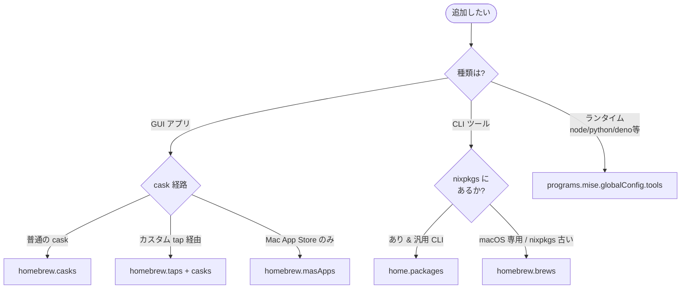

# Claude 向け作業指針（このリポジトリ用）

個人 macOS 環境の dotfiles（aarch64-darwin / user: `tommy`）。
スタック: **nix-darwin + home-manager + chezmoi + 1Password**。

## 用語

このリポジトリで使う正規語彙は [`docs/glossary.md`](docs/glossary.md) に従う
— 所有レイヤー（`nix-darwin` / `home-manager` / `chezmoi` / `1Password`）、
chezmoi prefix（`executable_` / `private_` / `encrypted_` / `run_once_` /
`run_onchange_`）、ビルド / 適用コマンド（`darwin-rebuild build/switch` /
`chezmoi diff/apply/re-add`）、配布（`install.sh` / `aarch64-darwin`）、
運用（`main` / `feature branch` / `pre-push hook`）など。`Don't call it:`
側の同義語は使わない。用語の追加・改名はコード変更と **同一 PR で** この
ファイルへ反映する。
詳細: [docs/reproduction-architecture.md](docs/reproduction-architecture.md) /
進捗: [docs/roadmap.md](docs/roadmap.md) /
環境素材: [docs/system-inventory.md](docs/system-inventory.md) /
運用: [docs/operations.md](docs/operations.md)

**最終目標**: このマシンを破棄しても新しい Mac で `install.sh` ワンコマンドで同等の環境が再現できる状態を維持する。

## アーキテクチャ（責務分担、絶対の鉄則）

| 領域 | 所有 | 場所 |
|---|---|---|
| パッケージ（nixpkgs にあるもの） | **home-manager** | `home/modules/packages.nix` |
| GUI / cask / カスタム tap / mas | **nix-darwin homebrew** | `system/modules/homebrew.nix` |
| macOS defaults | **nix-darwin** | `system/modules/defaults.nix` |
| DSL のあるプログラム設定（zsh など） | **home-manager** `programs.*` | `home/modules/*.nix` |
| 手編集の生 dotfile / バイナリ資産 | **chezmoi** | `chezmoi/dot_*` |
| シークレット（SSH 鍵 / PAT 等） | **chezmoi + 1Password `op`** | `chezmoi/private_*.tmpl` |

**1 ファイル 1 所有**。Nix と chezmoi の両方が同じファイルを管理してはいけない（事故の主因）。

## インストール先の判断フロー



**原則: 迷ったら Nix**（reproducibility / Linux 互換 / hash pin）。GUI と macOS 統合（SSH agent / Spotlight / pkg-installer 等）が要るものは無理に Nix にしない。

グレーゾーン例:

| 対象 | 採用 | 理由 |
|---|---|---|
| `_1password-cli` (op) | Nix | CLI、nixpkgs にある、`onepasswordRead` template の前提 |
| `1password` GUI | Brew cask | `.app`、SSH agent / op CLI 連携が cask に乗る |
| `font-*-nerd-font` | Brew cask | cask 版は `~/Library/Fonts` に置くので Spotlight / 他アプリから見える |
| `docker` CLI | Nix | colima 経由、CLI のみ必要 |
| `mise` 本体 | home-manager `programs.mise` | `enable = true` で zsh init まで自動 wiring |

## レイアウト規約

- `.chezmoiroot = chezmoi` — リポジトリ直下は Nix flake、dotfile ソースは `chezmoi/` 配下。
- リポジトリ運用ファイル（`README.md` `install.sh` `docs/` `.github/` `CLAUDE.md` 等）は `chezmoi/` の**外**にあるため `$HOME` に適用されない。
- `chezmoi/` 配下のスクリプトは `executable_` 接頭辞で +x を再現（**CI で強制**）。
- 例外的に `run_*` と `.chezmoiscripts/` 配下は chezmoi 自身が実行するので接頭辞不要。

## GitHub / CI

- **`main` は唯一の永続ブランチ**（2026-05-27 に `rebuild` を統合・削除。CI も main へ単発）。作業は短命な feature ブランチを切り、**PR 経由で `main` に squash-merge** する（直 push はしない）。
- **フロー**: `git checkout -b <type>/<topic>` → 論理単位で commit → `git push -u origin <branch>` → `gh pr create` → CI green → `gh pr merge --squash`（`--auto` 可）。実例は [docs/operations.md](docs/operations.md)。
- **コミットメッセージは gitmoji + Conventional Commits**: `:sparkles: feat(nix): ...` / `:memo: docs(roadmap): ...` / `:bug: fix(...): ...`。`git log -n 20` でスタイルを確認してから書く。
- **CI ジョブ（[.github/workflows/ci.yml](.github/workflows/ci.yml)、push と PR でトリガー）**:
  - `nix flake check --no-build` — Nix の型/eval 検査（Linux runner）
  - `shellcheck` — `install.sh` 静的解析
  - 規約検知 — `chezmoi/` 配下 shebang スクリプトの `executable_` 接頭辞強制
  - `chezmoi templates render` — 全 `.tmpl` の `execute-template` 検証
- **CI green を確認してからマージ**。失敗したら**新規コミットで修正**（push 済みへの `--amend` は使わない）。
- **`--force` push / 履歴改変は禁止**（ユーザー明示指示がある場合のみ）。
- **push は pre-push フック（[.githooks/pre-push](.githooks/pre-push)）が `chezmoi verify` で apply 忘れを検知して止める**。乖離（`chezmoi status` の `R` 含む）があれば `chezmoi apply` してから push する。緊急時のみ `git push --no-verify`。詳細 → [docs/operations.md §5.11](docs/operations.md)。

## シークレット取扱（YOU MUST）

- **YOU MUST NOT** secret 値（API トークン / 鍵 / パスワード / PAT 等）を **print / log / echo / コミットメッセージ / コマンド文字列 / テンプレートにリテラル化** しない。
- secret は常に **参照** で扱う: `$(op read "op://Vault/Item/field")` / `$(gh auth token)` / `$ENV_VAR`。
- chezmoi テンプレで秘密を扱うときは `onepasswordRead "op://..."` を使い、`op signin` は既に通っている前提とする。
- **`home.file.*.text` に secret を書かない**（`/nix/store` は world-readable）。
- secret ファイルを chezmoi に置く場合は `private_` 接頭辞（権限 600）か `encrypted_` 接頭辞（age/gpg）必須。

## 作業時の絶対ルール

1. **検証ゲートを必ず通す**:
   - chezmoi 編集後 → `chezmoi diff` でソース⇔実体一致を確認してから commit
   - Nix 編集後 → `nix flake check` ＋ `darwin-rebuild build`（非破壊）通過後に switch
2. **`switch` は sudo パスワード入力が要るので、コマンドを提示してユーザーに実行させる**（このセッションからは sudo を直接呼ばない）。
3. **生成パイプラインを再導入しない**。設定は静的ファイルとして表現する。
4. **破壊的 git 操作を避ける**: `--force` push / 履歴改変 / `--amend`（push 済みコミットへ）はユーザー明示指示なしに禁止。

## 既知の落とし穴（読まずに「修正」を試みない）

- `sudo darwin-rebuild` は PATH を引き継がないので **`sudo /run/current-system/sw/bin/darwin-rebuild ...`** とフルパス指定する。
- Determinate Nix と二重管理しないため **`nix.enable = false`**（host nix に設定済）。`/etc/nix/nix.custom.conf` には触らない。
- switch 直後の親シェルでは `__NIX_DARWIN_SET_ENVIRONMENT_DONE=1` を継承して PATH 異常に見える false positive がある。**検証は新ターミナル or `env -i HOME=$HOME /bin/zsh -l -c '...'`** で行う。
- `homebrew.onActivation.cleanup = "none"` 据え置き。`"zap"` 化は Phase 4 残りを全部宣言化してからユーザー確認の上で。
- brew 同梱 `mas 1.8.6` は macOS 15+ で `mas get/install` が壊れている。`homebrew.masApps` 宣言は当面凍結（Nix 側 mas 6.0.1 は動くが nix-darwin homebrew モジュールが brew の mas を呼ぶため迂回できない）。
- `system.defaults` は **ByHost ドメイン（`-currentHost`）には書けない**。Display 配置や一部 Finder 詳細は activationScripts で `defaults -currentHost write` を使う以外手がない。
- macOS の **TCC/sandbox で保護されたアプリ**（Mail / Safari / Calendar 等）の defaults は switch が成功しても無音で適用されない。AI は「修正」追加で深追いしない。
- chezmoi run スクリプトは **`run_onchange_` 既定**（idempotent）。`run_once_` は本当に一度きりの bootstrap でのみ使う。
- chord config パス（`dot_config/chord/private_config.toml`）は `.tmpl` の `{{ include }}`・`verify-chord-*.yml` の `paths:`・`gen-chord-doc.py` の **4 箇所**が指す。リネーム時は同時更新（PR #123 で古参照を踏んだ）。config 文法を released chord より先行させると `verify-chord-validate.yml`（tap の chord で strict 検証）が落ちる。`.tmpl` 自体は read-only で他リポに副作用なし。詳細 → [docs/operations.md §5.7](docs/operations.md)。
- 編集を許したい AI/ユーザー共有ファイル（例: `~/.claude/settings.json`）は home.file に直接書かず **`mkOutOfStoreSymlink`** で逃がす（直書きは Nix store immutable で AI 編集できなくなる）。

## よく使うコマンド（Claude が推測できないもの）

```sh
# Nix 側（システム/パッケージ）
nix flake check --no-build                                                       # eval のみ
nix run nix-darwin#darwin-rebuild -- build --flake .#default --impure            # 非破壊ビルド
sudo /run/current-system/sw/bin/darwin-rebuild switch --flake .#default --impure # 実適用
sudo /run/current-system/sw/bin/darwin-rebuild --rollback                        # 1世代戻す

# chezmoi 側（手編集 dotfile）
chezmoi diff                                                                     # ソース⇔実体（必ず apply 前に）
chezmoi --source ./chezmoi execute-template < <file.tmpl>                        # tmpl レンダ検証（CI と同じ）
chezmoi apply -v
chezmoi add <path>                                                               # 実体取り込み（chezmoi/ 配下へ）

# 1Password（secret 注入の前提として op signin 済を想定）
op read "op://Vault/Item/field"
```

## Roadmap board (GitHub Projects)

この repo の issue は集約 Project「roadmap」(akira-toriyama #5・
https://github.com/users/akira-toriyama/projects/5)で管理。Claude もこれに従う:

- 新規 issue は **Inbox** 既定。off-board の open issue を残さない(迷子を作らない)。
- Status(single-select): `Inbox → Backlog → Ready → In Progress → Done` / `Icebox`=someday。Ready は 2〜3(WIP)。
- PR 本文に `Closes #N` を必ず書く → merge で issue 自動 close → 自動 Done。
- 詳細は Project の README。
