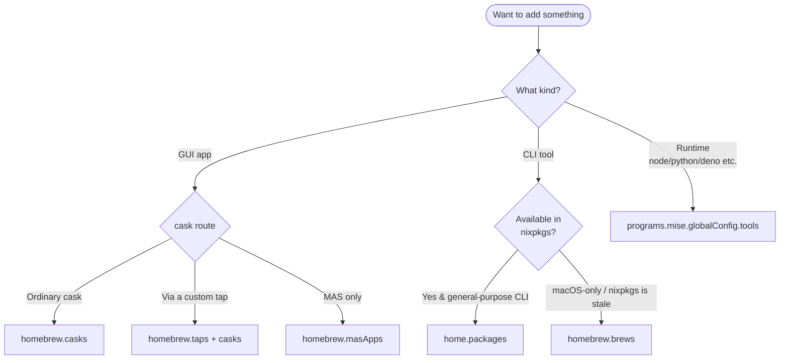

# Working instructions for Claude (for this repository)

dotfiles for a personal macOS environment (aarch64-darwin / user: `tommy`).
Stack: **nix-darwin + home-manager + chezmoi + 1Password**.

## Vocabulary

The canonical vocabulary used in this repository follows [`docs/glossary.md`](docs/glossary.md)
— ownership layers (`nix-darwin` / `home-manager` / `chezmoi` / `1Password`),
chezmoi prefixes (`executable_` / `private_` / `modify_` / `create_` / `encrypted_` /
`run_once_` / `run_onchange_`), build / apply commands (`darwin-rebuild build/switch` /
`chezmoi diff/apply/re-add`), distribution (`install.sh` / `aarch64-darwin`),
operations (`main` / `feature branch` / `pre-push hook`), and so on. Do not use the
synonyms on the `Don't call it:` side. Reflect additions and renames of terms
into that file **in the same PR** as the code change.
Details: [docs/reproduction-architecture.md](docs/reproduction-architecture.md) /
progress: [docs/roadmap.md](docs/roadmap.md) /
environment materials: [docs/system-inventory.md](docs/system-inventory.md) /
operations: [docs/operations.md](docs/operations.md) /
enforcement status of the global CLAUDE.md rules: [docs/claude-md-ledger.md](docs/claude-md-ledger.md)

**The ultimate goal**: keep the state where, even if this machine is discarded, a new Mac reproduces an equivalent environment with the one command `install.sh`.

## Architecture (ownership split — the absolute iron rules)

| Area | Owner | Location |
|---|---|---|
| Packages (whatever is in nixpkgs) | **home-manager** | `home/modules/packages.nix` |
| GUI / cask / custom tap / mas | **nix-darwin homebrew** | `system/modules/homebrew.nix` |
| macOS defaults | **nix-darwin** | `system/modules/defaults.nix` |
| Program configs that have a DSL (zsh etc.) | **home-manager** `programs.*` | `home/modules/*.nix` |
| Hand-edited raw dotfiles / binary assets | **chezmoi** | `chezmoi/dot_*` |
| Secrets (SSH keys / PATs etc.) | **chezmoi + 1Password `op`** | `chezmoi/private_*.tmpl` |
| Claude instructions / skills / agents / hooks | **chezmoi** | `chezmoi/private_dot_claude/` + `chezmoi/dot_local/bin/` |

**One file, one owner.** Nix and chezmoi must never both manage the same file (the main cause of accidents).

## Install-target decision flow


```mermaid
flowchart TD
    Start([Want to add something]) --> Q1{What kind?}
    Q1 -->|GUI app| Q2{cask route}
    Q1 -->|CLI tool| Q3{Available in<br/>nixpkgs?}
    Q1 -->|Runtime<br/>node/python/deno etc.| M[programs.mise.globalConfig.tools]
    Q2 -->|Ordinary cask| C1[homebrew.casks]
    Q2 -->|Via a custom tap| C2[homebrew.taps + casks]
    Q2 -->|MAS only| C3[homebrew.masApps]
    Q3 -->|Yes & general-purpose CLI| N1[home.packages]
    Q3 -->|macOS-only / nixpkgs is stale| C4[homebrew.brews]
```

**Principle: when in doubt, Nix** (reproducibility / Linux compatibility / hash pin). Do not force into Nix what needs GUI and macOS integration (SSH agent / Spotlight / pkg-installer etc.).

Gray-zone examples:

| Target | Choice | Why |
|---|---|---|
| `_1password-cli` (op) | Nix | CLI, in nixpkgs, the prerequisite of the `onepasswordRead` template |
| `1password` GUI | Brew cask | `.app`; SSH agent / op CLI integration rides on the cask |
| `font-*-nerd-font` | Brew cask | the cask edition places fonts in `~/Library/Fonts`, so Spotlight / other apps can see them |
| `docker` CLI | Nix | via colima; only the CLI is needed |
| `mise` itself | home-manager `programs.mise` | `enable = true` auto-wires as far as zsh init |

## Layout conventions

- `.chezmoiroot = chezmoi` — the repository root is the Nix flake; dotfile sources live under `chezmoi/`.
- Repository-operations files (`README.md` `install.sh` `docs/` `.github/` `CLAUDE.md` etc.) are **outside** `chezmoi/` and therefore not applied to `$HOME`.
- Scripts under `chezmoi/` reproduce +x with the `executable_` prefix (**enforced by CI**).
- As the exception, `run_*` and anything under `.chezmoiscripts/` are executed by chezmoi itself, so they need no prefix.

## GitHub / CI

- **`main` is the only permanent branch** (`rebuild` was absorbed and deleted on 2026-05-27; CI is also a single run against main). Cut a short-lived feature branch for work, and **squash-merge it into `main` through a PR** (no direct push).
- **Flow**: `git checkout -b <type>/<topic>` → commit in logical units → `git push -u origin <branch>` → `gh pr create` → CI green → `gh pr merge --squash` (`--auto` is fine). Worked examples are in [docs/operations.md](docs/operations.md).
- **Commit messages are gitmoji-driven** (`<:gitmoji:>[(<scope>)][!] <subject>`; the Conventional `<type>` words are retired). The canonical source of the convention is .github's [CONTRIBUTING.md](https://github.com/akira-toriyama/.github/blob/main/CONTRIBUTING.md) ([docs/commit-convention.md](docs/commit-convention.md) is the fleet-distributed pointer; the machine check = `glyph lint`). **Before pushing: `glyph lint --range origin/main..HEAD`** (history still carries commits in the retired format, so do not take `git log` as a model).
- **CI jobs ([.github/workflows/ci.yml](.github/workflows/ci.yml), triggered on push and PR)**:
  - `nix flake check --no-build` — Nix type/eval checks (Linux runner)
  - `lint` — `scripts/lint` in one shot (ruff / mypy --strict / shfmt / shellcheck / actionlint / typos / lychee --offline / gitleaks / `.tmpl` gets shellcheck and plist-syntax checks after rendering / existence of the paths inside code spans). **The same command runs locally**: `nix develop .#lint --command scripts/lint`
  - `script test` — the Stop hook's fixture tests + the unittests of `scripts/` and `scripts/claude-md-eval/`
  - Convention check — enforces the `executable_` prefix on shebang scripts under `chezmoi/` (exceptions: `run_*` / `modify_*` / `.chezmoiscripts/`)
  - `chezmoi templates render` — `execute-template` verification of every `.tmpl`
- **Confirm CI green before merging.** On failure, fix with a **new commit** (rule 4 of "Absolute rules when working" is the canonical source for whether `--amend` / `--force` push / history rewriting are allowed).
- **On push, the pre-push hook ([.githooks/pre-push](.githooks/pre-push)) runs `chezmoi verify` for a push that touches chezmoi/ and warns on drift but does not stop the push (warn-only, since 2026-07-03, for Claude-led operation).** When you notice drift, bring live back in line with `chezmoi apply`. The permanent gates are carried by CI (darwin build/switch smoke + chezmoi apply + templates render) and main's branch protection. Details → [docs/operations.md §5.11](docs/operations.md).

## Secret handling (YOU MUST)

- **YOU MUST NOT** print / log / echo secret values (API tokens / keys / passwords / PATs etc.), nor turn them into literals in **commit messages / command strings / templates**.
- Always handle a secret **by reference**: `$(op read "op://Vault/Item/field")` / `$(gh auth token)` / `$ENV_VAR`.
- When a chezmoi template handles a secret, use `onepasswordRead "op://..."` and assume `op signin` has already been done.
- **Do not write a secret into `home.file.*.text`** (`/nix/store` is world-readable).
- A secret file placed in chezmoi requires the `private_` prefix (mode 600) or the `encrypted_` prefix (age/gpg).

## Absolute rules when working

1. **Always pass the verification gates**:
   - After editing chezmoi → confirm source ⇔ live agreement with `chezmoi diff` before committing
   - After editing Nix → switch only after `nix flake check` plus `darwin-rebuild build` (non-destructive) pass
2. **`switch` needs a sudo password entry, so present the command and have the user run it** (as of this session, do not call sudo directly).
3. **Do not reintroduce a generation pipeline.** Express configuration as static files.
4. **Avoid destructive git operations**: `--force` push / history rewriting / `--amend` (onto a pushed commit) are forbidden without the user's explicit instruction.
5. **This repo is Claude-led (since 2026-07-03)**: ordinary git / gh / chezmoi / PR operations (branch creation, commit, push, PR open/merge, `chezmoi diff/apply`) may be executed without asking the user each time. The rules above hold the exceptions: ① `darwin-rebuild switch` (sudo) — present the command and have the user run it, per rule 2 ② destructive git — only on the user's explicit instruction, per rule 4 ③ the verification gates (rule 1) are "passed yourself", not "asked about".

## When changing the prose of the global CLAUDE.md or a skill (obligations specific to this repo)

The source of the global `~/.claude/CLAUDE.md` is in this repo
(`chezmoi/private_dot_claude/CLAUDE.md`), so the obligations around changing it sit here
(not on the always-loaded global side).

- After changing **behavior-targeting prose** (output shape, work closing, anything of
  skill-description grade), measure it with
  [`scripts/claude-md-eval`](scripts/claude-md-eval/README.md) before distributing (reading
  alone cannot tell whether it works — a track record of 2 defective rules among the first
  draft's 8). Edits that only correct facts, turn prose into pointers, or compress are out
  of scope. A full rewrite is measured with `--baseline` (two arms, old version vs new version).
- A PR that adds, deletes, or moves a rule updates the relevant row of
  [docs/claude-md-ledger.md](docs/claude-md-ledger.md) (for a deletion, the deletion-log
  section) **in the same PR**.
- A PR that touches CLAUDE.md or skills/ also makes the relevant terms of
  [docs/glossary.md](docs/glossary.md) follow **in the same PR** (when unnecessary, commit
  footer `Glossary-unchanged: <理由>`). A paired obligation with the ledger; both are
  enforced by the lint gate claude-md-guard.
- Do not replay the bloat of the global CLAUDE.md: an addition is only "prevention of the
  recurrence of an already-hit failure" (apply the same standard as global's
  mechanization rule to prose as well).

## Known pitfalls (do not attempt a "fix" without reading)

- `sudo darwin-rebuild` does not carry PATH over, so spell the full path: **`sudo /run/current-system/sw/bin/darwin-rebuild ...`**.
- **`nix.enable = false`** to avoid double management with Determinate Nix (already set for the host nix). Do not touch `/etc/nix/nix.custom.conf`.
- The parent shell right after a switch inherits `__NIX_DARWIN_SET_ENVIRONMENT_DONE=1` and shows a false positive that looks like a PATH anomaly. **Verify in a new terminal or with `env -i HOME=$HOME /bin/zsh -l -c '...'`**.
- `homebrew.onActivation.cleanup = "none"` stays as is. Moving to `"zap"` comes only after the rest of Phase 4 is all declarative, with the user's confirmation.
- `homebrew.masApps` is unused (zero MAS apps in use). Even when declared, flake.nix's `bootstrapBrewOverride` (`lib.mkForce { }`, which keeps switch from failing in bootstrap/CI/VM where the App Store is not signed in) makes live always empty — "declared but it does not get installed" is not a defect. Details → section 3 of [docs/operations.md](docs/operations.md).
- `system.defaults` **cannot write ByHost domains (`-currentHost`)**. Display arrangement and some Finder details have no way other than `defaults -currentHost write` in activationScripts.
- defaults of macOS apps **protected by TCC/sandbox** (Mail / Safari / Calendar etc.) are silently not applied even when switch succeeds. The AI must not chase them by adding "fixes".
- chezmoi run scripts default to **`run_onchange_`** (idempotent). Use `run_once_` only for genuinely one-time bootstrap.
- The chord config path (`dot_config/chord/private_config.toml`) is pointed at from **4 places**: the `.tmpl`'s `{{ include }}`, the `paths:` of `verify-chord-*.yml`, and `gen-chord-doc.py`. Update them together on a rename (PR #123 stepped on a stale reference). Letting the config syntax run ahead of released chord breaks `verify-chord-validate.yml` (strict validation with the tap's chord). The `.tmpl` itself is read-only, with no side effects on other repos. Details → [docs/operations.md §5.7](docs/operations.md).
- Do not write an AI/user-shared file that should stay editable (e.g. `~/.claude/settings.json`) directly into home.file (the Nix store is immutable, so the AI can no longer edit it). **The real mechanism is a chezmoi `modify_` script** — [`chezmoi/private_dot_claude/modify_settings.json`](chezmoi/private_dot_claude/modify_settings.json) receives live on stdin, guarantees only the keys it must, and passes the rest through. `mkOutOfStoreSymlink` is used in **not one place** in this repo (measured), so do not write anything that presumes it.

## Frequently used commands (the ones Claude cannot guess)

```sh
# Nix side (system/packages)
nix flake check --no-build                                                       # eval only
nix run nix-darwin#darwin-rebuild -- build --flake .#default --impure            # non-destructive build
sudo /run/current-system/sw/bin/darwin-rebuild switch --flake .#default --impure # actually takes effect
sudo /run/current-system/sw/bin/darwin-rebuild --rollback                        # back one generation

# chezmoi side (hand-edited dotfiles)
chezmoi diff                                                                     # source ⇔ live (always before apply)
chezmoi --source ./chezmoi execute-template < <file.tmpl>                        # execute-template verification (same as CI)
chezmoi apply -v
chezmoi add <path>                                                               # bring a live file in (under chezmoi/)

# 1Password (secret injection assumes op signin is done)
op read "op://Vault/Item/field"
```

## Roadmap board / task tracker

For dotfiles work tasks (backlog, design notes, handovers), **the canonical source is furrow + the private repo
[`akira-toriyama/projects`](https://github.com/akira-toriyama/projects)**.
The entrance in this repo is `furrow ls -r dotfiles` (candidates to start = ready / in-progress) / `furrow show <id>` /
filing is `furrow add "…" -r dotfiles -s icebox -e <epic>` (lane and box are explicit — projects Standing orders 4 and 5; omitting them means falling to `inbox` + the lint error `epic-required`).

**Do not duplicate the conventions for attribution, labels, board auto-derivation, sync, or the PR footer here** — the fleet-wide practice is
the Workflow section of the global `~/.claude/CLAUDE.md`, and the canon of the operating rules is
[`projects/CLAUDE.md`](https://github.com/akira-toriyama/projects/blob/main/CLAUDE.md).

The issue operation (the aggregate Project "roadmap" #5, the Inbox/Status flow, `Closes #N`) is a remnant of the family-wide
policy; **the canonical source of tasks has moved to furrow**. **Project #5 and the remaining open issues are treated as a manual mirror**
(do not destroy them). A dotfiles PR closes its furrow task with the `SetStatus-task:` footer
(`.github/workflows/task-status.yml` is fleet-synced).
