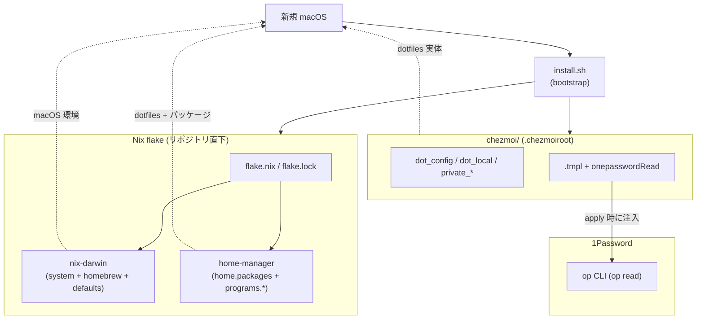
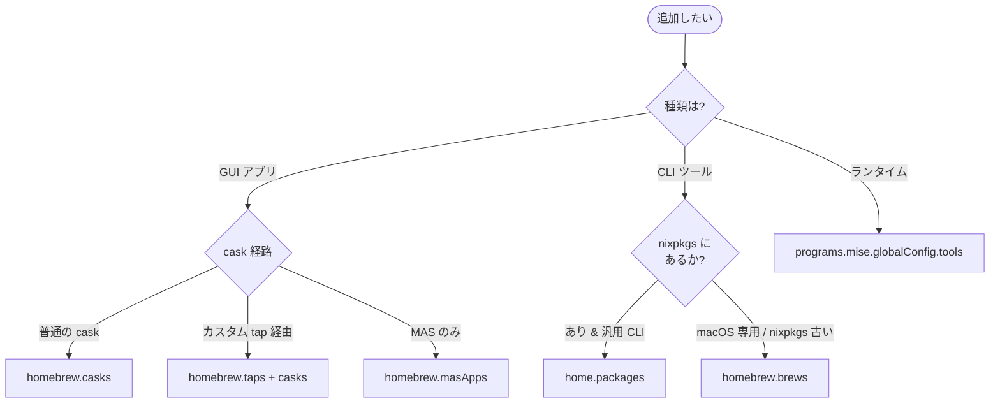

<!--
この文書は glossary.md（英語・正本）の和訳です。人間向け。
最新とは限りません — 基準: 英語版 @ d388a3b。
同時更新はしない — 人間の指示があった時に、基準 commit からの差分を訳して基準を進める。
-->

---
title: dotfiles 用語集
tags: [glossary, macos, nix, chezmoi]
repo: dotfiles
aliases: []
---

# 用語集 — dotfiles のユビキタス言語

dotfiles を構成する各パーツの **正規の呼び名** をまとめた規範ドキュメント。
**コード・ドキュメント・コミットメッセージ・PR タイトル・Claude Code への
プロンプト、すべてここに載っている名前のみを使う**。同義語は揺らぎを生む。
1 つに決めて、それで通す。

なお **正規名は英語のまま** 保持する。コード識別子・設定キー・コマンド
（`home-manager`, `chezmoi`, `nix-darwin`, `homebrew.casks`, `op` など）
と一対一に対応させるため。日本語化するのは説明文だけ。

用語が足りなければ、その用語を導入する PR で同時にこのファイルへ追記する。
用語名を変える場合は、コード・ドキュメント・このファイルを **同一 PR で**
書き換える。

> 各エントリの形式: **正規名**, 1〜2 行の定義, 設定 / コードでの所在,
> そして `Don't call it:` 行 — このエントリが置き換える誤った呼び名のリスト。

**`Don't call it:` の効き方（誤読しやすいので明記）**: 禁じているのは
「**そのエントリの概念を、その名前で呼ぶこと**」であって、その語の一般使用ではない。
たとえば `darwin-rebuild switch` の `Don't call it: apply` は「switch を apply と呼ぶな」の意味で、
`chezmoi apply`（それ自体が正規名）を禁じない。同様に `適用` `取り込み` `ビルド確認` のような
一般語も、**別の正規名を持つ操作を指す時にだけ**違反になる。
この非対称性のため、**単純な grep では強制できない**（台帳の印は 📖）。

---

## 全体像

dotfiles は **4 つの所有レイヤー**（nix-darwin / home-manager / chezmoi /
1Password）+ ブートストラップ（`install.sh`）で構成される。**1 ファイル
1 所有** が鉄則
（[docs/reproduction-architecture.md](reproduction-architecture.md)）。

下の図は **インストール先の判定フロー**（既存図を正規語彙で書き直したもの。
CLAUDE.md にも同等の図あり）。

---

## 所有レイヤー（鉄則: 1 ファイル 1 所有）

### nix-darwin
**macOS システム / homebrew / defaults を宣言的に所有**するレイヤー。
- 場所: [`system/modules/`](../system/modules/)
- 含むもの: `system.defaults`, `homebrew.{casks,brews,taps,masApps}`,
  LaunchAgent 等
- **Don't call it:** darwin nix, macos nix, システム Nix

### home-manager
**ユーザー領域（パッケージ / DSL ある dotfile）を所有**するレイヤー。
- 場所: [`home/modules/`](../home/modules/)
- 含むもの: `home.packages`, `programs.zsh` / `git` / `starship` / `mise` 等
- **Don't call it:** hm, user nix, ユーザー Nix

### chezmoi
**生 dotfile / バイナリ資産 / シークレット参照テンプレ**を所有するレイヤー。
- 場所: [`chezmoi/`](../chezmoi/)（`.chezmoiroot` でルート指定）
- **Don't call it:** dotfile manager, ドットファイル管理（一般語は可）

### 1Password (`op`)
**シークレットの唯一の格納先**。リポジトリにはリテラル値を置かず、
**参照**（`op read "op://Vault/Item/field"`）で apply 時に注入。
- CLI: `_1password-cli` (Nix 経由) + `1password` GUI (Brew cask)
- **Don't call it:** 1pass, op cli（cli 単体を指す時のみ可）, シークレット
  ストア

### Service Account (`op-sa`)
**無人・agent 用の 1Password 機械アカウント**（`claude-automation`）。
[[Automation vault]] のみ read-only。wrapper
[`op-sa`](../chezmoi/dot_local/bin/executable_op-sa) が token を注入して
biometric なしで `op read` を通す。token はグローバル export しない
（使う瞬間だけ注入）。人間の対話は従来の `op`（app 統合 + Touch ID）。
- **Don't call it:** bot account, automation token, SA トークン（token
  自体を指す時のみ可）

### Automation vault
**[[Service Account (`op-sa`)]] が読める唯一の vault**。Claude の無人作業に
要る secret だけを選んで入れる（Personal vault は仕様上 SA に付与不可）。
中身の追加・削除は自由（SA の vault アクセス自体は immutable）。
- **Don't call it:** bot vault, claude vault, 自動化保管庫

---

## ビルド / 適用

### `flake.nix`
リポジトリ直下の Nix flake エントリ。[[nix-darwin]] / [[home-manager]] / nix-homebrew
を組合せる。
- **Don't call it:** nix entry, ニックスエントリ

### `darwin-rebuild build`
**非破壊ビルド**。`switch` の前段で必ず通す検証ゲート。
- **Don't call it:** dry-run, test build, ビルド確認

### `darwin-rebuild switch`
**実適用**。sudo 必要（ユーザーがパスワード入力。AI は直接呼ばない）。
PATH 継承の問題で **フルパス** `sudo /run/current-system/sw/bin/darwin-rebuild
switch ...` で呼ぶ。
- **Don't call it:** apply, deploy, system update, 切替

### brew bundle receipt
**`brew bundle` が失敗したときに activation が残すファイル**:
`/var/log/dotfiles/brew-bundle.failed`。`homebrew-nonfatal.nix` が失敗した formula で
activation を中断させなくなったため、switch の exit code は brew の異常を報告しない ——
代わりに receipt がそれを運ぶ。書き手は
[`system/modules/scripts/brew-bundle-nonfatal.sh`](../system/modules/scripts/brew-bundle-nonfatal.sh)、
読み手は `install.sh`（`V6-brew-bundle` の検査が `RESULT: FAILED` に変換する）と、
receipt が無ければ switch が常に 0 を返すようになった時点で発火しなくなる switch fallback。bundle が成功する
たびに消えるので、古い receipt が結果を FAILED に固定することはない。
- **Don't call it:** brew ログ, エラーファイル, marker

### `chezmoi diff`
**ソース ⇔ 実体の差分**。`apply` 前に必ず通す検証ゲート。
- **Don't call it:** preview, dry-run, プレビュー

### `chezmoi apply`
[[chezmoi]] 管理ファイルを `$HOME` に書き出す **実適用**。
- **Don't call it:** sync, deploy, 適用

### `chezmoi re-add`
**実体 → ソース** 方向の取込（`~/.config/<app>/...` を編集した後の正規手順）。
順序を守らない（先に `apply` する）と古い source が実体を上書きして編集が
消える。
- **Don't call it:** import, take, 取り込み

---

## chezmoi 規約

### `executable_` prefix
**[[chezmoi]] 配下のスクリプトに +x を再現するための prefix**。CI が強制
（[`.github/workflows/ci.yml`](../.github/workflows/ci.yml)）。`run_*` と
`.chezmoiscripts/` 配下は例外（chezmoi 自身が実行するので prefix 不要）。
- **Don't call it:** exec prefix, x prefix, 実行プレフィックス

### `private_` prefix
**[[chezmoi]] で権限 600 を再現する prefix**。secret ファイルに必須。
- **Don't call it:** secret prefix, restricted prefix, 機密プレフィックス

### `encrypted_` prefix
**age / gpg で暗号化された秘密ファイル**の prefix。`private_` の代替。
- **この repo に実インスタンスは無い**（2026-07-27 実測 0 件）。secret ファイルを
  置く必要が出たときの規範として残している。
- **Don't call it:** crypt prefix, secure prefix

### `modify_` prefix
**既存の live ファイルを stdin で受け取り、stdout で書き戻す** [[chezmoi]] の
差分マージ script。全置換しないので、ユーザー / AI が live 側に足した設定を
保ったまま特定のキーだけを保証できる。
- 適用例: [`chezmoi/private_dot_claude/modify_settings.json`](../chezmoi/private_dot_claude/modify_settings.json)
  （`~/.claude/settings.json` に 5 項目を保証し、他は pass-through）
- **Don't call it:** merge script, patch script, マージスクリプト

### `create_` prefix
**存在しないときだけ生成する** [[chezmoi]] の prefix。以後 live 側の変更を上書きしない。
- 適用例: `chezmoi/private_dot_ssh/create_private_known_hosts`
- **Don't call it:** init file, seed file, 初期生成

### `.tmpl` + `onepasswordRead`
[[chezmoi]] テンプレに secret を **参照** として埋め込む正規パターン。
リテラル値は書かない。前提: `op signin` 済み。
- **この repo に実インスタンスは無い**（2026-07-27 実測: `chezmoi/` 配下 0 件）。
  無人 / agent 読み取りの実経路は [[Service Account (`op-sa`)]]。
- **Don't call it:** secret template, op template, シークレットテンプレ

### `run_once_` / `run_onchange_` / `run_onchange_after_`
[[chezmoi]] の **scripts 発火ポリシー**。`run_onchange_` が既定（idempotent）。
`run_once_` は本当に一度きりの bootstrap でのみ使う。`_after_` は同一 apply 内での
実行順序を後ろに寄せるサフィックス。
- **Don't call it:** init script, setup hook, 初期化スクリプト

### `mkOutOfStoreSymlink`
nix store 外のファイルへ symlink を張る [[home-manager]] イディオム。
- **この repo では使っていない**（2026-07-27 実測: `*.nix` に 0 件）。AI / ユーザーが
  編集する共有ファイル（`~/.claude/settings.json`）の実機構は上の [[`modify_` prefix]]。
  将来 home-manager 側で逃がしたくなったときの選択肢として名前だけ残す。
- **Don't call it:** writable symlink, out-of-store link, 書き換え可能リンク

---

## ブートストラップ / 配布

### `install.sh`
**新規 macOS の最終目標**: このスクリプト 1 つで同等環境を再現できる
状態を維持する。**単一ステージ・無人一気通貫**（CLT → workspace volume → Nix(.pkg)
→ clone → switch → chezmoi → SSH gate → ghq-get-mine → claude-memory link →
事後条件検証）。GUI 操作（FDA 付与・1Password サインイン/agent ON/鍵承認・
自動ロックタイマー OFF）は**事前準備に front-load** する。`✓ 完了` は全 phase +
検証を通過した時だけ出る。
- **Don't call it:** setup, bootstrap script, セットアップ

### `--phase2`
install.sh の**リカバリ入口**。SSH gate（1Password）起因の失敗を直した後、
導入系 phase（CLT/Nix/switch）を再評価せず、sudoers drop-in の self-heal →
事後条件検証（システム層）→ clone 以降（SSH gate → ghq-get-mine → link →
clone 検証）を実行する。通常経路ではない（通常はワンライナー再実行 = 冪等）。
- **Don't call it:** stage 2, 後半モード, 対話モード

### `summary.txt`
install.sh の各 run が `~/.dotfiles-install/<run-id>/` に残す機械可読サマリ
（result / failed / last_phase / log 位置）。LLM・人間はまずこれを読む。
`latest` symlink が最新 run を指す。
- **Don't call it:** report, result.txt, ログ本体

### `ghq-get-mine`
**自リポジトリ一括 clone コマンド**。GitHub 上の akira-toriyama の active
（非 archived）repo を `GHQ_ROOT`（`/Volumes/workspace`）へ ghq レイアウトで
SSH clone する。冪等（clone 済みは no-op）。install.sh の `clone` phase
（`df_step ghq-get-mine`）と日常の新 repo 追従で使う。
- 所在: [`home/modules/packages.nix`](../home/modules/packages.nix)
  （`writeShellScriptBin`）/ 運用手順は
  [operations.md §5.12](operations.md)
- **Don't call it:** clone-all, repo 一括取得スクリプト, ghq sync

### `aarch64-darwin`
唯一のサポート arch。flake はこの platform をターゲットする。
- **Don't call it:** apple silicon, m1/m2, arm mac

---

## GitHub / CI / 運用

### `main` (唯一の永続ブランチ)
**2026-05-27 に `rebuild` 統合・削除**。作業は短命な feature ブランチを切り、
PR 経由で `main` に squash-merge する（直 push なし）。
- **Don't call it:** master, develop, default branch（git の用語としては可）

### feature branch
**短命**ブランチ。命名は `<type>/<topic>` で `type` は `docs` / `feat` /
`fix` / `refactor` / `chore` 等。PR → CI green → `gh pr merge --squash`。
- 散文中の **「feature ブランチ」は同じものの日本語表記として可**（正規名を英語で保つ
  規則 :21-23 に沿う混在表記）。`feature branch` と揺れていても違反ではない。
- **Don't call it:** topic branch, work branch, 作業ブランチ

### pre-push hook
[`.githooks/pre-push`](../.githooks/pre-push) が chezmoi/ を触る push で
`chezmoi verify` を実行し、乖離（`chezmoi status` の `R` 含む）を**警告する**
（**warn-only、2026-07-03〜。push は止めない** — Claude 主導運用のため）。
気づいたら `chezmoi apply` で live を追従。恒久ゲートは CI と main の
ブランチ保護が担う。詳細 → [operations.md §5.11](operations.md)。
- **Don't call it:** pre-push check, verify hook, プッシュ前検証

### `chezmoi templates render` (CI)
全 `.tmpl` の `execute-template` 検証 CI ジョブ。
- **Don't call it:** template lint, tmpl check, テンプレ検証

### ルール台帳 (claude-md-ledger)
[`docs/claude-md-ledger.md`](claude-md-ledger.md)。global CLAUDE.md の各ルールに
「Claude の手番 / ユーザーの手番 / 機構」の 3 列と強制状態の印（🔒/🟡/📖/🙅）を
付けた索引。ルール本文は転記しない（正本は CLAUDE.md の節）。📖 の行 =
機構化バックログ。ルールの追加・変更と**同一 PR** でこの台帳も更新する。
- **Don't call it:** rule list, ルール一覧, enforcement matrix

---

## グレーゾーン判定の正規語彙

### `homebrew.casks` vs `home.packages`
**casks** = GUI / cask 経路 / macOS 統合（SSH agent / Spotlight / pkg-installer）。
**home.packages** = nixpkgs にあり Linux 互換が要る CLI。迷ったら **Nix**
（reproducibility / Linux 互換 / hash pin）。
- 例: `_1password-cli` (Nix), `1password` GUI (Brew cask),
  `font-*-nerd-font` (Brew cask, `~/Library/Fonts` Spotlight 連携のため)

### `programs.mise.globalConfig.tools`
**ランタイム**（node / python / deno 等）の所有先。`home-manager` `programs.mise`
を `enable = true` にすると zsh init まで自動 wire される。
- **Don't call it:** asdf, version manager（一般名としては可）

---

## 連携先（外部リポ）の参照

### `chord` (in dotfiles context)
**macOS host bridge for canon (ZMK)**。`chezmoi/dot_config/chord/private_config.toml`
が本体、`.tmpl` の `{{ include }}` で組み立てる。リネーム時は
[`docs/operations.md`](operations.md) §5.7 の **4 箇所同時更新** を厳守。
config 文法を released chord より先行させると `verify-chord-validate.yml`
（tap の chord で strict 検証）が落ちる。
- 参照: [`docs/chord.md`](chord.md)
- **`chord config` は禁止語ではない** — chord CLI の実サブコマンド名
  （`chord config --validate`）であり、設定ファイルそのものを指す語としても正しい。
  禁じるのは **bridge 本体**を「chord config」と呼ぶこと。
- **Don't call it:**（bridge 本体の呼び名として）hotkey config, ホットキー設定

### `halo` / `facet` / `wand` (in dotfiles context)

dotfiles が **config だけを持つ**自作 macOS アプリ 3 本（アプリ本体は各 repo）。
`chord` と同じく `chezmoi/dot_config/<name>/config.toml` が chezmoi 管理下にあり、
**アプリ側は読むだけ**（dotfiles からアプリを起動・ビルドしない）。

| 名前 | 何をするか | config |
|---|---|---|
| `halo` | アクティブウィンドウの枠（border ring）を描く | [`chezmoi/dot_config/halo/config.toml`](../chezmoi/dot_config/halo/config.toml) — 未知キーは既定値に落ちるので typo で壊れない |
| `facet` | デスクトップ演出（focus ring / pets 等）。`#:schema` 行で taplo 補完が効く | [`chezmoi/dot_config/facet/config.toml`](../chezmoi/dot_config/facet/config.toml) — schema sidecar は `facet --emit-schema` 由来 |
| `wand` | パネル / カード UI。GUI 設定を持たず config が唯一の正本 | [`chezmoi/dot_config/wand/config.toml`](../chezmoi/dot_config/wand/config.toml) |

- **Don't call it:** WM スタック（旧 borders/rift/focusfx は drop 済みで別物）、
  ランチャー、オーバーレイ設定

---

## 既知の落とし穴の正規語彙

- `__NIX_DARWIN_SET_ENVIRONMENT_DONE` — switch 直後の親シェルで PATH 異常
  に見える false positive のフラグ。**検証は新ターミナル** か
  `env -i HOME=$HOME /bin/zsh -l -c '...'`。
- `nix.enable = false` — Determinate Nix と二重管理しない既定。
  `/etc/nix/nix.custom.conf` には触らない。
- ByHost ドメイン（`-currentHost`） — `system.defaults` から **書けない**。
  Display 配置や一部 Finder 詳細は `activationScripts` で
  `defaults -currentHost write` を使う以外手がない。

---

## Claude Code を助ける自作 CLI

いずれも akira-toriyama 製で、[`home/modules/packages.nix`](../home/modules/packages.nix) の
`sourceBuiltCLI`（呼ぶたび clone を incremental build する wrapper）で PATH に載る。
**brew 版は入れない**（`/opt/homebrew/bin` が nix profile より前なので wrapper を shadow する）。
使いどころの正典は global CLAUDE.md の Tools 節 — ここは呼び名の定義だけ。

### `furrow`
**タスク管理 CLI**。この repo のタスクの正本は furrow + private tracker repo `projects`。
- **Don't call it:** todo CLI, task tracker, タスクツール／install 版・brew 版

### `glyph`
**commit 規約のエンジン**（subject の sigil → semver → release notes）。lint も semver も notes も glyph。
- **Don't call it:** commitlint, conventional-commits ツール, git-cliff

### `pare`
**1 回のコマンド出力を予算内に切り詰める**（head + error-match + tail）。`| tail` の代わり。
- **Don't call it:** truncate, output clipper, ログ切り詰め

### `cifail`
**CI 失敗の要点抽出**。生 run ログを漁らずに失敗 step のエラー行だけを取る。
- **Don't call it:** ci log viewer, gh run view のラッパ

### `rundiff`
**同一コマンドの前回実行との差分**だけを出す（pare が 1 回の出力を切るのに対し、実行間を切る）。
- **Don't call it:** output diff, テスト差分

### `revpost`
**findings JSON を PR レビュー 1 本に束ねて投稿**する。アンカーを diff の commentable 行に照合する。
- **Don't call it:** review bot, コメント投稿ツール

### `projects`
**board の規約 CLI**（`lint` / `burndown` / `epic provision`）。board の構造は furrow が持ち、
その上に載る規約をこれが持つ。`projects` の checkout から source-run するので、
リリース identity は無く `--version` も無い。
- **Don't call it:** projects_cli.py, board lint, タスク CLI

### `peekaboo` / `wait4x`
自作ではなく **adopt 済の外部 CLI**。peekaboo = macOS の AX ツリー取得と操作（GUI 検証）、
wait4x = 条件待ち（ログ行 / port / HTTP / プロセス）。手書きの `until` + `sleep` は書かない。
- 所在: peekaboo = [`system/modules/homebrew.nix`](../system/modules/homebrew.nix)（`steipete/tap/peekaboo`）、
  wait4x = [`home/modules/packages.nix`](../home/modules/packages.nix)
- **Don't call it:** AX ダンプツール, ポーリングループ

---

## Claude asset（`chezmoi/private_dot_claude/`）

Claude Code 自身の設定・知識を [[chezmoi]] で再現するレイヤー。
**所有は chezmoi**（Nix ではない — 1 ファイル 1 所有の鉄則）。

### global CLAUDE.md
**全 repo に効く Claude への常時ロード指示書**。source =
[`chezmoi/private_dot_claude/CLAUDE.md`](../chezmoi/private_dot_claude/CLAUDE.md) →
配布先 `~/.claude/CLAUDE.md`。**live を直接編集しない**（次の apply で剥がれる）。
- **Don't call it:** システムプロンプト, グローバル設定, AI ルール

### skill（`SKILL.md`）
**特定の作業で読み込ませる知識パック**で、ここで書き・ここが持つもの。
`chezmoi/private_dot_claude/skills/<name>/SKILL.md`。
frontmatter の `description` が「いつ発火するか」を決める。サードパーティ側の対応物が
[[plugin]] で、両者は入れ替え可能ではない — だから「プラグイン」は Don't call it に残る。
- **Don't call it:** プラグイン, ナレッジベース, プロンプトテンプレ

### plugin
**marketplace から入れるサードパーティの機能パックで、中身をこの repo が書かないもの** — ここで書き・
ここが持つ [[skill]] の対応物。宣言は `~/.claude/settings.json` の 2 キー:
`extraKnownMarketplaces`（marketplace の取得元）と `enabledPlugins`（どれを有効にするか）。
- **plugin は 1 つも入れていない**（2026-08-31）。JetBrains の `modern-go-guidelines` を採用した当日に
  撤去した — 実セッションで 0/3 しか発火せず、一方で全 repo の毎セッションに費用が掛かっていた。
  理由と復活条件は[台帳](claude-md-ledger.md)の削除記録。語を残すのは、`skill` との境界が効いているのと、
  次の候補も同じ測り方で判断するため。
- 再び採用する場合: state ディレクトリ `~/.claude/plugins/`（バイナリキャッシュ + `.in_use` の PID）は
  chezmoi の管理下に**置かない**。また `modify_settings.json` は自分が書いていないキーを消さないので、
  宣言を外すだけでは既に入っているマシンから消えない。
- **Don't call it:** skill, スキル, 拡張, アドオン

### agent（`fable-architect`）
**サブエージェントの定義**。`chezmoi/private_dot_claude/agents/<name>.md`。
`tools:` に載せないツールは harness が拒否する（＝許可を構造で担保する場所）。
- **Don't call it:** サブエージェント設定, ペルソナ

### Stop hook（`claude-work-report-check`）
**セッション終了時に走る判定スクリプト**。作業報告に task ID（か「なし」）と増減の実数が
無ければ停止をブロックする。実体 =
[`chezmoi/dot_local/bin/executable_claude-work-report-check`](../chezmoi/dot_local/bin/executable_claude-work-report-check)、
回帰テストは CI の `hook scripts test`。
- **Don't call it:** 終了フック, 報告チェッカー

### PreToolUse guard（`claude-*-guard`）
**ツール呼び出しの直前に走り、通す / 訊く / 拒む を決めるスクリプト**。
現在 3 本 —— [`claude-fanout-cwd-guard`](../chezmoi/dot_local/bin/executable_claude-fanout-cwd-guard)（別 worktree へのファンアウトを拒む）/
[`claude-vncdo-guard`](../chezmoi/dot_local/bin/executable_claude-vncdo-guard)（deadline の無い vncdo を拒む）/
[`claude-board-shard-guard`](../chezmoi/dot_local/bin/executable_claude-board-shard-guard)（furrow の board shard 直編集を訊く）。
どれも **fail-open**（自身が壊れたら通す）で **narrow scope**（誤検知した guard は
guard 全体を無視させる）。配線は `modify_settings.json`。
- **Don't call it:** 事前フック, パーミッションフィルタ, ツールガード

### `claude-md-eval`
**CLAUDE.md の散文変更を配る前に測るハーネス**。baseline（節なし）と candidate（節あり）の
応答を作り、盲検で判定してリリースゲートを掛ける。実体 =
[`scripts/claude-md-eval/`](../scripts/claude-md-eval/README.md)。
- **Don't call it:** プロンプト評価, A/B テスト基盤

### 台帳（`docs/claude-md-ledger.md`）
**global CLAUDE.md の各ルールが「機構で強制されているか / 散文頼みか」を 1 表にしたもの**。
ルール本文は転記しない（正本は CLAUDE.md）。ルールを足す・変える PR では同一 PR で更新する。
- **Don't call it:** ルール一覧, ポリシー表

### レビュー写し（`*.ja.md`）
**英語の正本の隣に置く、宣言付きの非正本な和訳**: 正本は正本であり続け、写しはユーザーの指示が
あったときにだけ進め、正本と同一の変更では決して更新しない。だから設計上遅れており、冒頭 4 行の
ヘッダが基準 commit を固定して遅れを宣言する。写しがどれだけ新しくても、正本が述べていない規則を
述べていれば欠陥。ゲートは fleet の `repo-policy` チェック（ヘッダを 和訳 / 正本 / 基準 で grep
する）と `scripts/lint` の `review-copy-guard`
（[`scripts/review_copy_guard.py`](../scripts/review_copy_guard.py)、escape = commit footer
`Review-copy-co-update:`）。正本は .github の
[`doc-consistency-policy.md`](https://github.com/akira-toriyama/.github/blob/main/docs/doc-consistency-policy.md)。
- **Don't call it:** translation, 翻訳版, README.ja, 和訳ファイル, ja doc

---

## エントリ追加時のルール

- 1 つの概念につき正規名は 1 つ。複数の呼び方が流通しているなら、
  このファイルで勝者を選び、敗者は `Don't call it:` 行に並べる。
- 正規名は **英語のまま** 書く。chezmoi prefix（`executable_`, `private_`,
  `encrypted_`, `run_once_`, `run_onchange_`）や Nix module キー
  （`home.packages`, `homebrew.casks`）はその表記を維持する。
- 定義は **1〜2 文** に収める。動作の詳細は
  [`docs/operations.md`](operations.md) /
  [`docs/reproduction-architecture.md`](reproduction-architecture.md) /
  ソースファイルへリンクし、ここで説明し直さない。
- 連携先リポ（canon / chord / wand / glance / eventfx / perch / facet）の
  用語と衝突しないか確認する。衝突する場合は `Don't call it:` に並べて
  棲み分けを明記する（例: dotfiles の **chord** ≠ canon の **combo**）。
