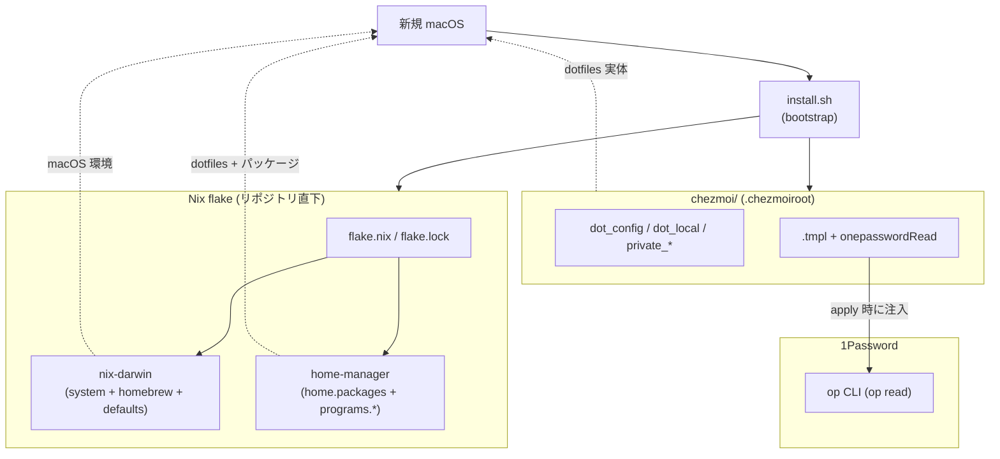
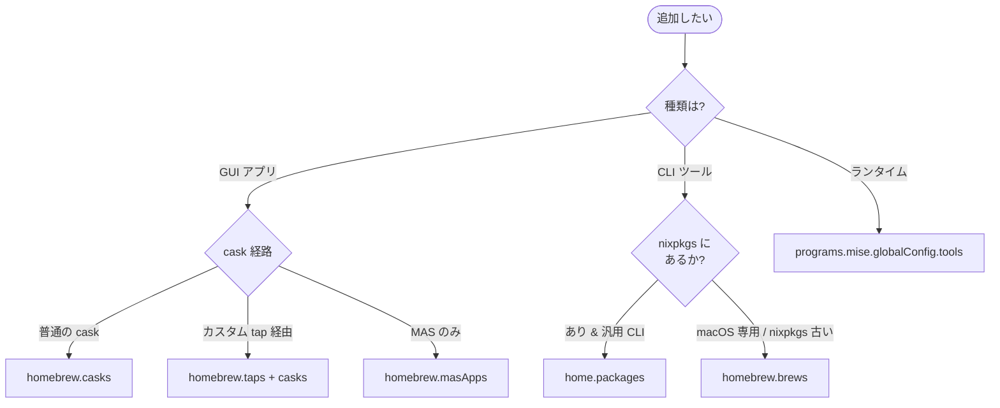

# 用語集 — dotfiles のユビキタス言語

dotfiles を構成する各パーツの **正規の呼び名** をまとめた規範ドキュメント。
**コード・ドキュメント・コミットメッセージ・PR タイトル・Claude Code への
プロンプト、すべてここに載っている名前のみを使う**。同義語は揺らぎを生む。
1 つに決めて、それで通す。

なお **正規名は英語のまま** 保持する。コード識別子・設定キー・コマンド
（`home-manager`, `chezmoi`, `nix-darwin`, `homebrew.casks`, `op` など）
と一対一に対応させるため。日本語化するのは説明文だけ。

用語が足りなければ、その用語を導入する PR で同時にこのファイルへ追記する。
用語名を変える場合は、コード・ドキュメント・このファイルを **同一 PR で**
書き換える。

> 各エントリの形式: **正規名**, 1〜2 行の定義, 設定 / コードでの所在,
> そして `Don't call it:` 行 — このエントリが置き換える誤った呼び名のリスト。

---

## 全体像

dotfiles は **4 つの所有レイヤー**（nix-darwin / home-manager / chezmoi /
1Password）+ ブートストラップ（`install.sh`）で構成される。**1 ファイル
1 所有** が鉄則
（[docs/reproduction-architecture.md](reproduction-architecture.md)）。

下の図は **インストール先の判定フロー**（既存図を正規語彙で書き直したもの。
CLAUDE.md にも同等の図あり）。

---

## 所有レイヤー（鉄則: 1 ファイル 1 所有）

### nix-darwin
**macOS システム / homebrew / defaults を宣言的に所有**するレイヤー。
- 場所: [`system/modules/`](../system/modules/)
- 含むもの: `system.defaults`, `homebrew.{casks,brews,taps,masApps}`,
  LaunchAgent 等
- **Don't call it:** darwin nix, macos nix, システム Nix

### home-manager
**ユーザー領域（パッケージ / DSL ある dotfile）を所有**するレイヤー。
- 場所: [`home/modules/`](../home/modules/)
- 含むもの: `home.packages`, `programs.zsh` / `git` / `starship` / `mise` 等
- **Don't call it:** hm, user nix, ユーザー Nix

### chezmoi
**生 dotfile / バイナリ資産 / シークレット参照テンプレ**を所有するレイヤー。
- 場所: [`chezmoi/`](../chezmoi/)（`.chezmoiroot` でルート指定）
- **Don't call it:** dotfile manager, ドットファイル管理（一般語は可）

### 1Password (`op`)
**シークレットの唯一の格納先**。リポジトリにはリテラル値を置かず、
**参照**（`op read "op://Vault/Item/field"`）で apply 時に注入。
- CLI: `_1password-cli` (Nix 経由) + `1password` GUI (Brew cask)
- **Don't call it:** 1pass, op cli（cli 単体を指す時のみ可）, シークレット
  ストア

---

## ビルド / 適用

### `flake.nix`
リポジトリ直下の Nix flake エントリ。[[nix-darwin]] / [[home-manager]] / nix-homebrew
を組合せる。
- **Don't call it:** nix entry, ニックスエントリ

### `darwin-rebuild build`
**非破壊ビルド**。`switch` の前段で必ず通す検証ゲート。
- **Don't call it:** dry-run, test build, ビルド確認

### `darwin-rebuild switch`
**実適用**。sudo 必要（ユーザーがパスワード入力。AI は直接呼ばない）。
PATH 継承の問題で **フルパス** `sudo /run/current-system/sw/bin/darwin-rebuild
switch ...` で呼ぶ。
- **Don't call it:** apply, deploy, system update, 切替

### `chezmoi diff`
**ソース ⇔ 実体の差分**。`apply` 前に必ず通す検証ゲート。
- **Don't call it:** preview, dry-run, プレビュー

### `chezmoi apply`
[[chezmoi]] 管理ファイルを `$HOME` に書き出す **実適用**。
- **Don't call it:** sync, deploy, 適用

### `chezmoi re-add`
**実体 → ソース** 方向の取込（`~/.config/<app>/...` を編集した後の正規手順）。
順序を守らない（先に `apply` する）と古い source が実体を上書きして編集が
消える。
- **Don't call it:** import, take, 取り込み

---

## chezmoi 規約

### `executable_` prefix
**[[chezmoi]] 配下のスクリプトに +x を再現するための prefix**。CI が強制
（[`.github/workflows/ci.yml`](../.github/workflows/ci.yml)）。`run_*` と
`.chezmoiscripts/` 配下は例外（chezmoi 自身が実行するので prefix 不要）。
- **Don't call it:** exec prefix, x prefix, 実行プレフィックス

### `private_` prefix
**[[chezmoi]] で権限 600 を再現する prefix**。secret ファイルに必須。
- **Don't call it:** secret prefix, restricted prefix, 機密プレフィックス

### `encrypted_` prefix
**age / gpg で暗号化された秘密ファイル**の prefix。`private_` の代替。
- **Don't call it:** crypt prefix, secure prefix

### `.tmpl` + `onepasswordRead`
[[chezmoi]] テンプレに secret を **参照** として埋め込む正規パターン。
リテラル値は書かない。前提: `op signin` 済み。
- **Don't call it:** secret template, op template, シークレットテンプレ

### `run_once_` / `run_onchange_`
[[chezmoi]] の **scripts 発火ポリシー**。`run_onchange_` が既定（idempotent）。
`run_once_` は本当に一度きりの bootstrap でのみ使う。
- **Don't call it:** init script, setup hook, 初期化スクリプト

### `mkOutOfStoreSymlink`
**AI / ユーザーが直接編集する dotfile** を nix store 外へ逃がす [[home-manager]]
イディオム。直書きすると `/nix/store` は immutable なので編集できない。
- 適用例: `~/.claude/settings.json`
- **Don't call it:** writable symlink, out-of-store link, 書き換え可能リンク

---

## ブートストラップ / 配布

### `install.sh`
**新規 macOS の最終目標**: このスクリプト 1 つで同等環境を再現できる
状態を維持する。
- **Don't call it:** setup, bootstrap script, セットアップ

### `aarch64-darwin`
唯一のサポート arch。flake はこの platform をターゲットする。
- **Don't call it:** apple silicon, m1/m2, arm mac

---

## GitHub / CI / 運用

### `main` (唯一の永続ブランチ)
**2026-05-27 に `rebuild` 統合・削除**。作業は短命な feature ブランチを切り、
PR 経由で `main` に squash-merge する（直 push なし）。
- **Don't call it:** master, develop, default branch（git の用語としては可）

### feature branch
**短命**ブランチ。命名は `<type>/<topic>` で `type` は `docs` / `feat` /
`fix` / `refactor` / `chore` 等。PR → CI green → `gh pr merge --squash`。
- **Don't call it:** topic branch, work branch, 作業ブランチ

### pre-push hook
[`.githooks/pre-push`](../.githooks/pre-push) が `chezmoi verify` で
**apply 忘れを検知**して push を止める。乖離（`chezmoi status` の `R` 含む）
があれば `chezmoi apply` してから push。緊急時のみ `git push --no-verify`。
- **Don't call it:** pre-push check, verify hook, プッシュ前検証

### `chezmoi templates render` (CI)
全 `.tmpl` の `execute-template` 検証 CI ジョブ。
- **Don't call it:** template lint, tmpl check, テンプレ検証

---

## グレーゾーン判定の正規語彙

### `homebrew.casks` vs `home.packages`
**casks** = GUI / cask 経路 / macOS 統合（SSH agent / Spotlight / pkg-installer）。
**home.packages** = nixpkgs にあり Linux 互換が要る CLI。迷ったら **Nix**
（reproducibility / Linux 互換 / hash pin）。
- 例: `_1password-cli` (Nix), `1password` GUI (Brew cask),
  `font-*-nerd-font` (Brew cask, `~/Library/Fonts` Spotlight 連携のため)

### `programs.mise.globalConfig.tools`
**ランタイム**（node / python / deno 等）の所有先。`home-manager` `programs.mise`
を `enable = true` にすると zsh init まで自動 wire される。
- **Don't call it:** asdf, version manager（一般名としては可）

---

## 連携先（外部リポ）の参照

### `chord` (in dotfiles context)
**macOS host bridge for canon (ZMK)**。`chezmoi/dot_config/chord/private_config.toml`
が本体、`.tmpl` の `{{ include }}` で組み立てる。リネーム時は
[`docs/operations.md`](operations.md) §5.7 の **4 箇所同時更新** を厳守。
config 文法を released chord より先行させると `verify-chord-validate.yml`
（tap の chord で strict 検証）が落ちる。
- 参照: [`docs/chord.md`](chord.md)
- **Don't call it:** chord config, hotkey config, ホットキー設定

---

## 既知の落とし穴の正規語彙

- `__NIX_DARWIN_SET_ENVIRONMENT_DONE` — switch 直後の親シェルで PATH 異常
  に見える false positive のフラグ。**検証は新ターミナル** か
  `env -i HOME=$HOME /bin/zsh -l -c '...'`。
- `nix.enable = false` — Determinate Nix と二重管理しない既定。
  `/etc/nix/nix.custom.conf` には触らない。
- ByHost ドメイン（`-currentHost`） — `system.defaults` から **書けない**。
  Display 配置や一部 Finder 詳細は `activationScripts` で
  `defaults -currentHost write` を使う以外手がない。

---

## エントリ追加時のルール

- 1 つの概念につき正規名は 1 つ。複数の呼び方が流通しているなら、
  このファイルで勝者を選び、敗者は `Don't call it:` 行に並べる。
- 正規名は **英語のまま** 書く。chezmoi prefix（`executable_`, `private_`,
  `encrypted_`, `run_once_`, `run_onchange_`）や Nix module キー
  （`home.packages`, `homebrew.casks`）はその表記を維持する。
- 定義は **1〜2 文** に収める。動作の詳細は
  [`docs/operations.md`](operations.md) /
  [`docs/reproduction-architecture.md`](reproduction-architecture.md) /
  ソースファイルへリンクし、ここで説明し直さない。
- 連携先リポ（canon / chord / wand / glance / eventfx / perch / facet）の
  用語と衝突しないか確認する。衝突する場合は `Don't call it:` に並べて
  棲み分けを明記する（例: dotfiles の **chord** ≠ canon の **combo**）。
