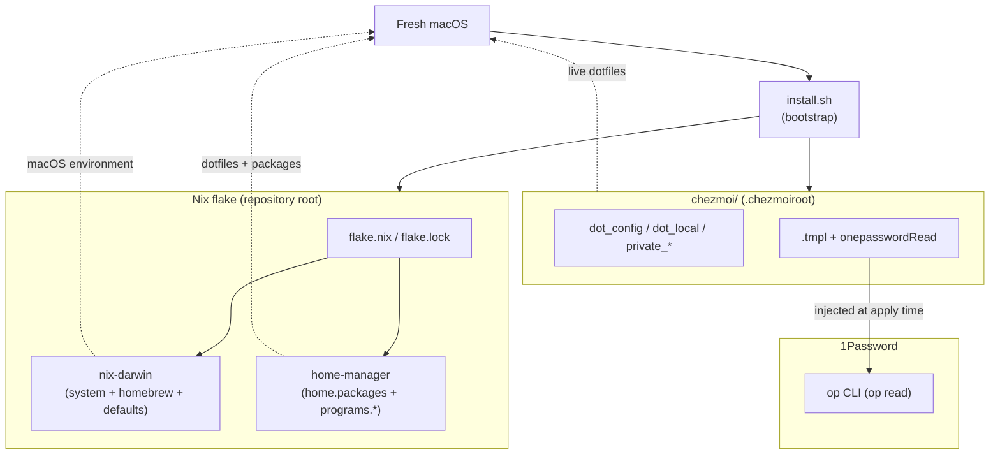
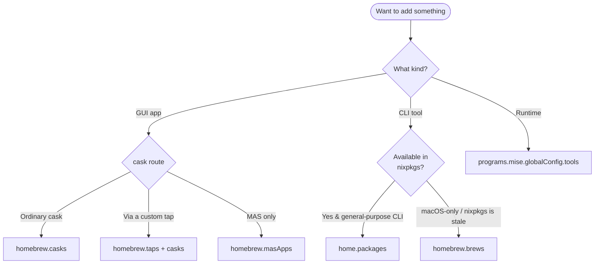

# Glossary — the ubiquitous language of dotfiles

A normative document collecting the **canonical names** of every part that makes up dotfiles.
**Code, documents, commit messages, PR titles, and prompts to Claude Code all use only the
names listed here**. Synonyms create drift. Decide on one and stay with it.

Note that **canonical names are kept in English**. This is to keep them one-to-one with code
identifiers, config keys, and commands (`home-manager`, `chezmoi`, `nix-darwin`,
`homebrew.casks`, `op`, etc.). Only the explanatory prose is translated.

If a term is missing, add it to this file in the same PR that introduces that term.
When a term is renamed, rewrite the code, the documents, and this file **in the same PR**.

> Format of each entry: **canonical name**, a definition of 1-2 lines, where it lives in config /
> code, and the `Don't call it:` line — the list of wrong names this entry replaces.

**How `Don't call it:` works (spelled out because it is easy to misread)**: what is forbidden is
"**calling that entry's concept by that name**", not general use of the word.
For example, `Don't call it: apply` on `darwin-rebuild switch` means "do not call switch apply",
and does not forbid `chezmoi apply` (which is a canonical name in its own right). Likewise general
words such as `適用` `取り込み` `ビルド確認` are a violation **only when they refer to an
operation that has a different canonical name**.
Because of this asymmetry, **a plain grep cannot enforce it** (the ledger marks it 📖).

---

## Big picture

dotfiles is built out of **four ownership layers** (nix-darwin / home-manager / chezmoi /
1Password) plus the bootstrap (`install.sh`). **One file, one owner** is the iron rule
([docs/reproduction-architecture.md](reproduction-architecture.md)).

```mermaid
flowchart TB
  USER["Fresh macOS"]
  INSTALL["install.sh<br/>(bootstrap)"]
  subgraph NIX["Nix flake (repository root)"]
    FLAKE["flake.nix / flake.lock"]
    DARWIN["nix-darwin<br/>(system + homebrew + defaults)"]
    HM["home-manager<br/>(home.packages + programs.*)"]
  end
  subgraph CHEZMOI["chezmoi/ (.chezmoiroot)"]
    DOTS["dot_config / dot_local / private_*"]
    TMPL[".tmpl + onepasswordRead"]
  end
  subgraph SECRETS["1Password"]
    OP["op CLI (op read)"]
  end
  USER --> INSTALL
  INSTALL --> NIX
  INSTALL --> CHEZMOI
  FLAKE --> DARWIN
  FLAKE --> HM
  TMPL -->|"injected at apply time"| OP
  DARWIN -.macOS environment.-> USER
  HM -.dotfiles + packages.-> USER
  CHEZMOI -.live dotfiles.-> USER
```

The diagram below is the **decision flow for where to install something** (the existing diagram
rewritten in the canonical vocabulary; CLAUDE.md carries an equivalent diagram).

```mermaid
flowchart TD
  Start([Want to add something]) --> Q1{What kind?}
  Q1 -->|GUI app| Q2{cask route}
  Q1 -->|CLI tool| Q3{Available in<br/>nixpkgs?}
  Q1 -->|Runtime| M["programs.mise.globalConfig.tools"]
  Q2 -->|Ordinary cask| C1["homebrew.casks"]
  Q2 -->|Via a custom tap| C2["homebrew.taps + casks"]
  Q2 -->|MAS only| C3["homebrew.masApps"]
  Q3 -->|Yes & general-purpose CLI| N1["home.packages"]
  Q3 -->|macOS-only / nixpkgs is stale| C4["homebrew.brews"]
```

---

## Ownership layers (iron rule: one file, one owner)

### nix-darwin
The layer that **declaratively owns the macOS system / homebrew / defaults**.
- Location: [`system/modules/`](../system/modules/)
- Contains: `system.defaults`, `homebrew.{casks,brews,taps,masApps}`,
  LaunchAgent, etc.
- **Don't call it:** darwin nix, macos nix, システム Nix

### home-manager
The layer that **owns the user domain (packages / dotfiles that have a DSL)**.
- Location: [`home/modules/`](../home/modules/)
- Contains: `home.packages`, `programs.zsh` / `git` / `starship` / `mise`, etc.
- **Don't call it:** hm, user nix, ユーザー Nix

### chezmoi
The layer that owns **raw dotfiles / binary assets / secret-reference templates**.
- Location: [`chezmoi/`](../chezmoi/) (the root is designated by `.chezmoiroot`)
- **Don't call it:** dotfile manager, ドットファイル管理 (fine as a general word)

### 1Password (`op`)
**The only place secrets are stored**. No literal value goes into the repository; secrets are
injected at apply time through a **reference** (`op read "op://Vault/Item/field"`).
- CLI: `_1password-cli` (via Nix) + `1password` GUI (Brew cask)
- **Don't call it:** 1pass, op cli (fine only when referring to the CLI alone), シークレット
  ストア

### Service Account (`op-sa`)
**The 1Password machine account for unattended / agent use** (`claude-automation`).
Read-only, on [[Automation vault]] alone. The wrapper
[`op-sa`](../chezmoi/dot_local/bin/executable_op-sa) injects the token and lets
`op read` through without biometrics. The token is never exported globally
(it is injected only at the moment of use). Human interaction stays on the usual `op`
(app integration + Touch ID).
- **Don't call it:** bot account, automation token, SA トークン (fine only when referring to
  the token itself)

### Automation vault
**The only vault [[Service Account (`op-sa`)]] can read**. Only the secrets Claude's unattended
work needs are picked and put in it (by design, the Personal vault cannot be granted to an SA).
Adding and removing contents is free (the SA's vault access itself is immutable).
- **Don't call it:** bot vault, claude vault, 自動化保管庫

---

## Build / apply

### `flake.nix`
The Nix flake entry at the repository root. It combines [[nix-darwin]] / [[home-manager]] /
nix-homebrew.
- **Don't call it:** nix entry, ニックスエントリ

### `darwin-rebuild build`
**A non-destructive build**. The verification gate that must always pass before `switch`.
- **Don't call it:** dry-run, test build, ビルド確認

### `darwin-rebuild switch`
**The step that actually takes effect**. Needs sudo (the user types the password; the AI does
not call it directly). Because of the PATH inheritance problem, invoke it by **full path**:
`sudo /run/current-system/sw/bin/darwin-rebuild switch ...`.
- **Don't call it:** apply, deploy, system update, 切替

### brew bundle receipt
**The file activation leaves behind when `brew bundle` fails**:
`/var/log/dotfiles/brew-bundle.failed`. Since `homebrew-nonfatal.nix` stops a failed formula
from aborting activation, the switch exit code no longer reports brew trouble — the receipt is
what carries it instead. Written by
[`system/modules/scripts/brew-bundle-nonfatal.sh`](../system/modules/scripts/brew-bundle-nonfatal.sh),
read by `install.sh` (check `V6-brew-bundle`, which turns it into `RESULT: FAILED`) and by the
switch fallback, which would otherwise stop firing once the switch always returns 0. Cleared on
every successful bundle, so a stale one cannot pin the result at FAILED.
- **Don't call it:** brew ログ, エラーファイル, marker

### `chezmoi diff`
**The source ⇔ live difference**. The verification gate that must always pass before `apply`.
- **Don't call it:** preview, dry-run, プレビュー

### `chezmoi apply`
Writes [[chezmoi]]-managed files out to `$HOME` — **the real apply**.
- **Don't call it:** sync, deploy, 適用

### `chezmoi re-add`
Re-adding in the **live → source** direction (the canonical procedure after editing
`~/.config/<app>/...`). If the order is not respected (running `apply` first), the stale source
overwrites the live file and the edits are gone.
- **Don't call it:** import, take, 取り込み

---

## chezmoi conventions

### `executable_` prefix
**The prefix that reproduces +x on scripts under [[chezmoi]]**. Enforced by CI
([`.github/workflows/ci.yml`](../.github/workflows/ci.yml)). `run_*` and anything under
`.chezmoiscripts/` are exceptions (chezmoi runs them itself, so no prefix is needed).
- **Don't call it:** exec prefix, x prefix, 実行プレフィックス

### `private_` prefix
**The prefix that reproduces mode 600 under [[chezmoi]]**. Mandatory for secret files.
- **Don't call it:** secret prefix, restricted prefix, 機密プレフィックス

### `encrypted_` prefix
The prefix for **secret files encrypted with age / gpg**. An alternative to `private_`.
- **There is no real instance in this repo** (measured 2026-07-27: 0 of them). It is kept as the
  norm for when a secret file has to be placed.
- **Don't call it:** crypt prefix, secure prefix

### `modify_` prefix
The [[chezmoi]] diff-merge script that **takes the existing live file on stdin and writes it back
on stdout**. Because it does not replace the whole file, it can guarantee only the specific
keys while keeping the settings a user / AI added on the live side.
- Example: [`chezmoi/private_dot_claude/modify_settings.json`](../chezmoi/private_dot_claude/modify_settings.json)
  (guarantees 5 items in `~/.claude/settings.json` and passes the rest through)
- **Don't call it:** merge script, patch script, マージスクリプト

### `create_` prefix
The [[chezmoi]] prefix that **creates the file only when it does not exist**. From then on it
never overwrites changes on the live side.
- Example: `chezmoi/private_dot_ssh/create_private_known_hosts`
- **Don't call it:** init file, seed file, 初期生成

### `.tmpl` + `onepasswordRead`
The canonical pattern for embedding a secret into a [[chezmoi]] template as a **reference**.
No literal value is written. Prerequisite: `op signin` already done.
- **There is no real instance in this repo** (measured 2026-07-27: 0 of them under `chezmoi/`).
  The real route for unattended / agent reads is [[Service Account (`op-sa`)]].
- **Don't call it:** secret template, op template, シークレットテンプレ

### `run_once_` / `run_onchange_` / `run_onchange_after_`
[[chezmoi]]'s **firing policy for scripts**. `run_onchange_` is the default (idempotent).
`run_once_` is used only for bootstrap that really happens exactly once. `_after_` is the suffix
that pushes execution later within the same apply.
- **Don't call it:** init script, setup hook, 初期化スクリプト

### `mkOutOfStoreSymlink`
The [[home-manager]] idiom for pointing a symlink at a file outside the nix store.
- **It is not used in this repo** (measured 2026-07-27: 0 occurrences in `*.nix`). The real
  mechanism for shared files that an AI / the user edits (`~/.claude/settings.json`) is the
  [[`modify_` prefix]] above. The name is kept only as an option for a future case where
  something has to be let out on the home-manager side.
- **Don't call it:** writable symlink, out-of-store link, 書き換え可能リンク

---

## Bootstrap / distribution

### `install.sh`
**The ultimate goal for a fresh macOS**: keep this one script able to reproduce an equivalent
environment. **Single stage, unattended, end to end** (CLT → workspace volume → Nix(.pkg)
→ clone → switch → chezmoi → SSH gate → ghq-get-mine → claude-memory link →
postcondition verification). GUI operations (granting FDA, 1Password sign-in / agent ON /
key approval, turning the auto-lock timer OFF) are **front-loaded into the preparation**.
`✓ 完了` is printed only when every phase plus the verification has passed.
- **Don't call it:** setup, bootstrap script, セットアップ

### `--phase2`
install.sh's **recovery entry point**. After a failure caused by the SSH gate (1Password) has
been fixed, it does not re-evaluate the installing phases (CLT/Nix/switch); it runs the sudoers
drop-in self-heal → postcondition verification (system layer) → everything from clone onward
(SSH gate → ghq-get-mine → link → clone verification). It is not the normal route (the normal
route is re-running the one-liner = idempotent).
- **Don't call it:** stage 2, 後半モード, 対話モード

### `summary.txt`
The machine-readable summary each install.sh run leaves in `~/.dotfiles-install/<run-id>/`
(result / failed / last_phase / log location). LLMs and humans read this first.
The `latest` symlink points at the newest run.
- **Don't call it:** report, result.txt, ログ本体

### `ghq-get-mine`
**The command that bulk-clones one's own repositories**. It SSH-clones akira-toriyama's
active (non-archived) repos on GitHub into `GHQ_ROOT` (`/Volumes/workspace`) in the ghq layout.
Idempotent (already-cloned ones are a no-op). Used in install.sh's `clone` phase
(`df_step ghq-get-mine`) and for keeping up with new repos day to day.
- Location: [`home/modules/packages.nix`](../home/modules/packages.nix)
  (`writeShellScriptBin`) / the operating procedure is
  [operations.md §5.12](operations.md)
- **Don't call it:** clone-all, repo 一括取得スクリプト, ghq sync

### `aarch64-darwin`
The only supported arch. The flake targets this platform.
- **Don't call it:** apple silicon, m1/m2, arm mac

---

## GitHub / CI / operations

### `main` (the only permanent branch)
**`rebuild` was consolidated and deleted on 2026-05-27**. Work happens on a short-lived feature
branch and is squash-merged into `main` through a PR (no direct push).
- **Don't call it:** master, develop, default branch (fine as git's own term)

### feature branch
A **short-lived** branch. Named `<type>/<topic>`, where `type` is `docs` / `feat` /
`fix` / `refactor` / `chore`, etc. PR → CI green → `gh pr merge --squash`.
- In prose, **「feature ブランチ」 is fine as the Japanese spelling of the same thing**
  (the mixed notation that follows the rule at :14-16 keeping canonical names in English).
  Varying with `feature branch` is not a violation.
- **Don't call it:** topic branch, work branch, 作業ブランチ

### pre-push hook
[`.githooks/pre-push`](../.githooks/pre-push) runs `chezmoi verify` on a push that touches
chezmoi/ and **warns** about drift (including `R` in `chezmoi status`)
(**warn-only, since 2026-07-03. It does not stop the push** — because this repo is run
Claude-led). On noticing it, bring live back in line with `chezmoi apply`. The permanent
gates are CI and branch protection on main. Details → [operations.md §5.11](operations.md).
- **Don't call it:** pre-push check, verify hook, プッシュ前検証

### `chezmoi templates render` (CI)
The CI job that verifies `execute-template` for every `.tmpl`.
- **Don't call it:** template lint, tmpl check, テンプレ検証

### Rule ledger (claude-md-ledger)
[`docs/claude-md-ledger.md`](claude-md-ledger.md). An index that gives each rule of the global
CLAUDE.md three columns — "Claude's move / the user's move / mechanism" — plus an
enforcement-state mark (🔒/🟡/📖/🙅). The rule text is not copied here (the canonical source is
the section in CLAUDE.md). A 📖 row = the mechanization backlog. This ledger is updated in the
**same PR** as the rule addition or change.
- **Don't call it:** rule list, ルール一覧, enforcement matrix

---

## Canonical vocabulary for gray-zone decisions

### `homebrew.casks` vs `home.packages`
**casks** = GUI / the cask route / macOS integration (SSH agent / Spotlight / pkg-installer).
**home.packages** = CLIs that are in nixpkgs and need Linux compatibility. When in doubt, **Nix**
(reproducibility / Linux compatibility / hash pin).
- Examples: `_1password-cli` (Nix), `1password` GUI (Brew cask),
  `font-*-nerd-font` (Brew cask, for the `~/Library/Fonts` Spotlight integration)

### `programs.mise.globalConfig.tools`
Where **runtimes** (node / python / deno, etc.) are owned. Setting `home-manager` `programs.mise`
to `enable = true` wires it all the way into zsh init automatically.
- **Don't call it:** asdf, version manager (fine as a generic name)

---

## References to the linked repositories (external repos)

### `chord` (in dotfiles context)
**macOS host bridge for canon (ZMK)**. `chezmoi/dot_config/chord/private_config.toml`
is the real thing, assembled with `{{ include }}` in the `.tmpl`. When renaming, strictly follow
the **four simultaneous updates** in [`docs/operations.md`](operations.md) §5.7.
Letting the config syntax run ahead of the released chord makes `verify-chord-validate.yml`
(strict validation with the tap's chord) fail.
- See: [`docs/chord.md`](chord.md)
- **`chord config` is not a forbidden name** — it is a real subcommand name of the chord CLI
  (`chord config --validate`), and it is also correct as a word for the config file itself.
  What is forbidden is calling the **bridge itself** "chord config".
- **Don't call it:** (as a name for the bridge itself) hotkey config, ホットキー設定

### `halo` / `facet` / `wand` (in dotfiles context)

Three home-built macOS apps for which dotfiles **holds only the config** (the apps themselves
live in their own repos). As with `chord`, `chezmoi/dot_config/<name>/config.toml` is under
chezmoi management, and **the app side only reads it** (dotfiles never launches or builds the apps).

| Name | What it does | config |
|---|---|---|
| `halo` | Draws the frame (border ring) of the active window | [`chezmoi/dot_config/halo/config.toml`](../chezmoi/dot_config/halo/config.toml) — unknown keys fall back to defaults, so a typo does not break it |
| `facet` | Desktop effects (focus ring / pets, etc.). The `#:schema` line makes taplo completion work | [`chezmoi/dot_config/facet/config.toml`](../chezmoi/dot_config/facet/config.toml) — the schema sidecar comes from `facet --emit-schema` |
| `wand` | Panel / card UI. It has no GUI settings, so the config is the only canonical source | [`chezmoi/dot_config/wand/config.toml`](../chezmoi/dot_config/wand/config.toml) |

- **Don't call it:** WM スタック (the old borders/rift/focusfx have been dropped and are a different thing)、
  ランチャー、オーバーレイ設定

---

## Canonical vocabulary for the known pitfalls

- `__NIX_DARWIN_SET_ENVIRONMENT_DONE` — the flag behind the false positive where the parent
  shell right after a switch looks like it has a broken PATH. **Verify in a new terminal** or
  with `env -i HOME=$HOME /bin/zsh -l -c '...'`.
- `nix.enable = false` — the default that avoids double management with Determinate Nix.
  Do not touch `/etc/nix/nix.custom.conf`.
- ByHost domain (`-currentHost`) — **cannot be written** from `system.defaults`.
  For display arrangement and some Finder details there is no way other than
  `defaults -currentHost write` in `activationScripts`.

---

## Home-built CLIs that help Claude Code

All of them are made by akira-toriyama and land on PATH through `sourceBuiltCLI` in
[`home/modules/packages.nix`](../home/modules/packages.nix) (a wrapper that incrementally
builds the clone on every call). **Do not install the brew versions** (`/opt/homebrew/bin` comes
before the nix profile, so it shadows the wrapper). The canonical source for when to use them is
the Tools section of the global CLAUDE.md — here it is only the definition of the names.

### `furrow`
**The task-management CLI**. The canonical source for this repo's tasks is furrow + the private
tracker repo `projects`.
- **Don't call it:** todo CLI, task tracker, タスクツール／install 版・brew 版

### `glyph`
**The engine of the commit convention** (subject sigil → semver → release notes). lint, semver
and notes are all glyph.
- **Don't call it:** commitlint, conventional-commits ツール, git-cliff

### `pare`
**Trims one command's output down to a budget** (head + error-match + tail). A replacement for
`| tail`.
- **Don't call it:** truncate, output clipper, ログ切り詰め

### `cifail`
**Extracts the essentials of a CI failure**. Takes only the error lines of the failing step,
without digging through the raw run log.
- **Don't call it:** ci log viewer, gh run view のラッパ

### `rundiff`
Prints only **the difference from the previous run of the same command** (where pare cuts within
one output, this cuts between runs).
- **Don't call it:** output diff, テスト差分

### `revpost`
**Bundles findings JSON into a single PR review and posts it**. It matches anchors against the
commentable lines of the diff.
- **Don't call it:** review bot, コメント投稿ツール

### `projects`
**The convention CLI for the board** (`lint` / `burndown` / `epic provision`). furrow owns the
board's structure; this owns the conventions layered on top of it. Source-run from the
`projects` checkout, so there is no release identity and no `--version`.
- **Don't call it:** projects_cli.py, board lint, タスク CLI

### `peekaboo` / `wait4x`
Not home-built — **external CLIs that have been adopted**. peekaboo = fetching and driving the
macOS AX tree (GUI verification), wait4x = waiting on a condition (log line / port / HTTP /
process). Do not hand-write `until` + `sleep`.
- Location: peekaboo = [`system/modules/homebrew.nix`](../system/modules/homebrew.nix) (`steipete/tap/peekaboo`),
  wait4x = [`home/modules/packages.nix`](../home/modules/packages.nix)
- **Don't call it:** AX ダンプツール, ポーリングループ

---

## Claude asset (`chezmoi/private_dot_claude/`)

The layer that reproduces Claude Code's own settings and knowledge with [[chezmoi]].
**Ownership is chezmoi** (not Nix — the iron rule of one file, one owner).

### global CLAUDE.md
**The always-loaded instruction document for Claude that applies in every repo**. source =
[`chezmoi/private_dot_claude/CLAUDE.md`](../chezmoi/private_dot_claude/CLAUDE.md) →
distributed to `~/.claude/CLAUDE.md`. **Do not edit live directly** (the next apply strips it).
- **Don't call it:** システムプロンプト, グローバル設定, AI ルール

### skill (`SKILL.md`)
**A knowledge pack loaded for a particular kind of work**.
`chezmoi/private_dot_claude/skills/<name>/SKILL.md`. The `description` in the frontmatter
decides "when it fires".
- **Don't call it:** プラグイン, ナレッジベース, プロンプトテンプレ

### agent (`fable-architect`)
**The definition of a subagent**. `chezmoi/private_dot_claude/agents/<name>.md`.
The harness refuses any tool not listed in `tools:` (= the place where permission is guaranteed
structurally).
- **Don't call it:** サブエージェント設定, ペルソナ

### Stop hook (`claude-work-report-check`)
**The decision script that runs when a session ends**. It blocks the stop unless the work report
carries a task ID (or 「なし」) and the real increase/decrease counts.
The real thing =
[`chezmoi/dot_local/bin/executable_claude-work-report-check`](../chezmoi/dot_local/bin/executable_claude-work-report-check),
with regression tests in CI's `hook scripts test`.
- **Don't call it:** 終了フック, 報告チェッカー

### PreToolUse guard (`claude-*-guard`)
**The script that runs immediately before a tool call and decides allow / ask / deny**.
Currently three — [`claude-fanout-cwd-guard`](../chezmoi/dot_local/bin/executable_claude-fanout-cwd-guard) (denies fan-out into another worktree) /
[`claude-vncdo-guard`](../chezmoi/dot_local/bin/executable_claude-vncdo-guard) (denies vncdo without a deadline) /
[`claude-board-shard-guard`](../chezmoi/dot_local/bin/executable_claude-board-shard-guard) (asks about direct edits to furrow's board shards).
All are **fail-open** (if the guard itself breaks, the call goes through) and **narrow scope**
(a guard that misfires makes the whole set of guards get ignored). The wiring is
`modify_settings.json`.
- **Don't call it:** 事前フック, パーミッションフィルタ, ツールガード

### `claude-md-eval`
**The harness that measures a prose change to CLAUDE.md before it is distributed**. It produces
responses for a baseline (without the section) and a candidate (with the section), judges them
blind, and puts a release gate on the result. The real thing =
[`scripts/claude-md-eval/`](../scripts/claude-md-eval/README.md).
- **Don't call it:** プロンプト評価, A/B テスト基盤

### Ledger (`docs/claude-md-ledger.md`)
**A single table of whether each rule of the global CLAUDE.md is "enforced by a mechanism or
relying on prose"**. The rule text is not copied here (the canonical source is CLAUDE.md).
A PR that adds or changes a rule updates it in the same PR.
- **Don't call it:** ルール一覧, ポリシー表

### Review copy (`*.ja.md`)
**A declared, non-canonical Japanese rendering placed beside its English original**: the original
stays canonical, the copy is advanced only on the user's instruction and never in the same change
as the original, so it lags by design and the four-line header declares the lag by pinning the
base commit. Stating a rule the original does not is a defect however fresh the copy is.
The gates are the fleet `repo-policy` check (it greps the header for 和訳 / 正本 / 基準) and
`scripts/lint`'s `review-copy-guard`
([`scripts/review_copy_guard.py`](../scripts/review_copy_guard.py); escape = commit footer
`Review-copy-co-update:`); the canonical source is .github's
[`doc-consistency-policy.md`](https://github.com/akira-toriyama/.github/blob/main/docs/doc-consistency-policy.md).
- **Don't call it:** translation, 翻訳版, README.ja, 和訳ファイル, ja doc

---

## Rules for adding an entry

- One canonical name per concept. If several ways of saying it are in circulation,
  pick the winner in this file and line the losers up on the `Don't call it:` line.
- Write canonical names **in English**. chezmoi prefixes (`executable_`, `private_`,
  `encrypted_`, `run_once_`, `run_onchange_`) and Nix module keys
  (`home.packages`, `homebrew.casks`) keep their own spelling.
- Keep the definition to **1-2 sentences**. For behavioral detail, link to
  [`docs/operations.md`](operations.md) /
  [`docs/reproduction-architecture.md`](reproduction-architecture.md) /
  the source file, and do not re-explain it here.
- Check that it does not collide with the vocabulary of the linked repos (canon / chord / wand /
  glance / eventfx / perch / facet). If it does, line them up on `Don't call it:` and spell out
  the separation (example: dotfiles' **chord** ≠ canon's **combo**).
